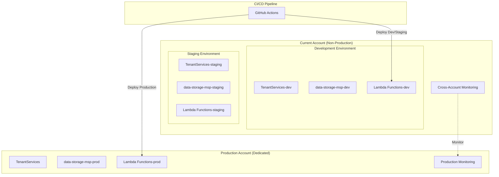

# AVESA Hybrid AWS Account Implementation

## Overview

This implementation provides a hybrid AWS account isolation strategy for the AVESA data pipeline, where production runs in a dedicated AWS account while development and staging environments remain in the current account.

## What Was Implemented

### 🏗️ Infrastructure Changes

1. **Updated CDK Application** ([`infrastructure/app.py`](infrastructure/app.py))
   - Added account configuration for hybrid approach
   - Environment-specific account targeting
   - Production account validation

2. **Modified Data Pipeline Stack** ([`infrastructure/stacks/data_pipeline_stack.py`](infrastructure/stacks/data_pipeline_stack.py))
   - Updated table naming for production (removes environment suffixes)
   - Maintains backward compatibility for dev/staging

3. **Cross-Account Monitoring Stack** ([`infrastructure/stacks/cross_account_monitoring.py`](infrastructure/stacks/cross_account_monitoring.py))
   - CloudWatch dashboards and alarms
   - Cross-account IAM roles for monitoring
   - SNS topics for alerting

### 🔧 Scripts and Automation

1. **Production Data Migration Script** ([`scripts/migrate-production-data.py`](scripts/migrate-production-data.py))
   - Migrates DynamoDB data (TenantServices-prod → TenantServices)
   - Migrates S3 data (data-storage-msp → data-storage-msp-prod)
   - Migrates AWS Secrets Manager secrets
   - Dry-run and validation capabilities

2. **Production Deployment Script** ([`scripts/deploy-prod.sh`](scripts/deploy-prod.sh))
   - Automated production deployment with validation
   - AWS profile verification
   - CDK bootstrapping and deployment
   - Post-deployment validation

3. **Validation Script** ([`scripts/validate-hybrid-setup.py`](scripts/validate-hybrid-setup.py))
   - Comprehensive setup validation
   - Infrastructure verification
   - Data migration validation
   - Functionality testing

### 🚀 CI/CD Integration

1. **GitHub Actions Workflow** ([`.github/workflows/deploy-production.yml`](.github/workflows/deploy-production.yml))
   - Automated production deployments
   - Cross-account IAM role assumption
   - Deployment validation and testing
   - Slack notifications

### 📚 Documentation

1. **Implementation Plan** ([`docs/AWS_ACCOUNT_ISOLATION_IMPLEMENTATION_PLAN.md`](docs/AWS_ACCOUNT_ISOLATION_IMPLEMENTATION_PLAN.md))
   - Comprehensive 6-phase implementation plan
   - Timeline and deliverables
   - Risk mitigation strategies

2. **Setup Guide** ([`docs/HYBRID_ACCOUNT_SETUP_GUIDE.md`](docs/HYBRID_ACCOUNT_SETUP_GUIDE.md))
   - Step-by-step implementation instructions
   - Troubleshooting guide
   - Security considerations

## Key Benefits Achieved

### 🔒 Security & Compliance
- **Production Isolation**: Complete separation of production data and resources
- **Compliance Readiness**: Foundation for SOC 2, ISO 27001 certifications
- **Blast Radius Reduction**: Development issues cannot affect production
- **Access Control**: Clear separation of production and non-production access

### 💰 Cost Management
- **Separate Billing**: Clear cost attribution per environment
- **Resource Optimization**: Environment-specific resource sizing
- **Cost Monitoring**: Dedicated billing alerts for production

### 🛠️ Operational Excellence
- **Simplified Development**: Dev/staging remain in single account
- **Production Security**: Dedicated account for customer data
- **Monitoring**: Cross-account observability
- **Automation**: Fully automated deployment pipeline

## Architecture Overview



## Implementation Status

### ✅ Completed
- [x] Infrastructure code updates
- [x] Data migration scripts
- [x] Deployment automation
- [x] CI/CD pipeline configuration
- [x] Cross-account monitoring setup
- [x] Comprehensive documentation
- [x] Validation scripts

### 🔄 Next Steps
1. **Create Production AWS Account**
   ```bash
   # Follow AWS account creation process
   # Configure AWS CLI profile: aws configure --profile avesa-production
   ```

2. **Set Up Cross-Account IAM Role**
   ```bash
   # Create deployment role in production account
   # Configure trust relationship with current account
   ```

3. **Deploy Infrastructure**
   ```bash
   export CDK_PROD_ACCOUNT=987654321098  # Your production account ID
   ./scripts/deploy-prod.sh
   ```

4. **Migrate Data**
   ```bash
   # Dry run first
   python3 scripts/migrate-production-data.py --dry-run
   
   # Execute migration
   python3 scripts/migrate-production-data.py --execute
   ```

5. **Validate Setup**
   ```bash
   python3 scripts/validate-hybrid-setup.py --environment prod
   ```

## File Structure

```
avesa/
├── infrastructure/
│   ├── app.py                              # Updated for hybrid accounts
│   └── stacks/
│       ├── data_pipeline_stack.py          # Updated table naming
│       └── cross_account_monitoring.py     # New monitoring stack
├── scripts/
│   ├── migrate-production-data.py          # Data migration script
│   ├── deploy-prod.sh                      # Production deployment
│   └── validate-hybrid-setup.py            # Setup validation
├── .github/workflows/
│   └── deploy-production.yml               # CI/CD for production
└── docs/
    ├── AWS_ACCOUNT_ISOLATION_IMPLEMENTATION_PLAN.md
    └── HYBRID_ACCOUNT_SETUP_GUIDE.md
```

## Environment Variables

### Required for Production Deployment
```bash
export CDK_PROD_ACCOUNT=987654321098        # Production AWS account ID
export CDK_DEFAULT_REGION=us-east-1         # AWS region
export AWS_PROFILE=avesa-production         # AWS CLI profile for production
```

### GitHub Secrets (for CI/CD)
```
AWS_ACCESS_KEY_ID_PROD                      # Production account access key
AWS_SECRET_ACCESS_KEY_PROD                  # Production account secret key
AWS_PROD_DEPLOYMENT_ROLE_ARN                # Cross-account deployment role ARN
SLACK_WEBHOOK_URL                           # Slack notifications (optional)
```

## Resource Naming Convention

### Development/Staging (Current Account)
- DynamoDB: `TenantServices-{env}`, `LastUpdated-{env}`
- S3: `data-storage-msp-{env}`
- Lambda: `avesa-{service}-{env}`

### Production (Dedicated Account)
- DynamoDB: `TenantServices`, `LastUpdated`
- S3: `data-storage-msp-prod`
- Lambda: `avesa-{service}-prod`

## Security Considerations

### Production Account Hardening
- Enable AWS GuardDuty
- Configure AWS Config rules
- Set up CloudTrail logging
- Implement least-privilege IAM policies
- Enable MFA for sensitive operations

### Cross-Account Access
- Use IAM roles with external ID
- Implement time-limited access tokens
- Monitor cross-account API calls
- Regular access reviews

## Monitoring and Alerting

### CloudWatch Dashboards
- Lambda function metrics (invocations, errors, duration)
- DynamoDB metrics (capacity, throttles)
- S3 metrics (requests, errors)
- Custom application metrics

### Alarms
- Lambda error rates
- Lambda duration thresholds
- DynamoDB throttling
- S3 error rates
- Cost thresholds

## Troubleshooting

### Common Issues
1. **Cross-account role access denied**
   - Verify trust policy and external ID
   - Check IAM permissions

2. **CDK deployment failures**
   - Ensure CDK is bootstrapped in production account
   - Verify AWS credentials and permissions

3. **Data migration errors**
   - Check source and destination table/bucket existence
   - Verify AWS profile configuration

### Support Resources
- [AWS Account Isolation Implementation Plan](docs/AWS_ACCOUNT_ISOLATION_IMPLEMENTATION_PLAN.md)
- [Hybrid Account Setup Guide](docs/HYBRID_ACCOUNT_SETUP_GUIDE.md)
- CloudWatch logs for detailed error messages
- AWS documentation for service-specific requirements

## Success Metrics

### Technical Metrics
- Zero data loss during migration
- All Lambda functions operational in production account
- Cross-account monitoring functional
- CI/CD pipeline success rate > 95%

### Business Metrics
- Zero customer-facing downtime during cutover
- Improved security posture score
- Compliance readiness assessment
- Reduced blast radius for development changes

## Future Enhancements

### Phase 2: Full Multi-Account Strategy
- Separate dev and staging accounts
- AWS Organizations implementation
- Centralized logging and monitoring
- Service Control Policies (SCPs)

### Compliance and Governance
- SOC 2 Type II certification
- ISO 27001 compliance
- GDPR data protection measures
- Regular security assessments

This implementation provides a solid foundation for production data isolation while maintaining operational simplicity for development workflows. The hybrid approach balances security, compliance, and operational efficiency for the AVESA data pipeline.