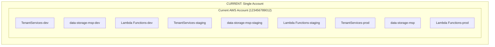
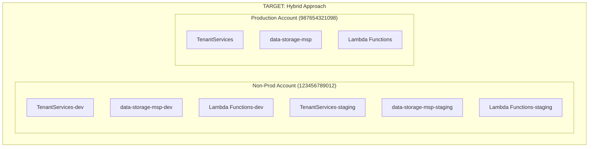

# AWS Account Isolation Implementation Plan
## Hybrid Approach: Production Account Separation

### Executive Summary

This document outlines the implementation plan for migrating AVESA's production environment to a dedicated AWS account while keeping development and staging environments in the current account. This hybrid approach provides production data isolation while maintaining operational simplicity for non-production environments.

### Current State vs Target State





## Phase 1: Pre-Migration Setup (Week 1)

### 1.1 Create Production AWS Account

**Tasks:**
- [ ] Create new AWS account for production
- [ ] Set up AWS Organizations (optional but recommended)
- [ ] Configure account-level security settings
- [ ] Set up billing alerts and cost monitoring

**Account Setup Checklist:**
```bash
# Account Security Configuration
- Enable CloudTrail in all regions
- Enable AWS Config
- Set up GuardDuty
- Configure IAM password policy
- Enable MFA for root account
- Create administrative IAM users
```

### 1.2 Cross-Account IAM Role Setup

**Create Deployment Role in Production Account:**
```json
{
  "Version": "2012-10-17",
  "Statement": [
    {
      "Effect": "Allow",
      "Principal": {
        "AWS": "arn:aws:iam::123456789012:root"
      },
      "Action": "sts:AssumeRole",
      "Condition": {
        "StringEquals": {
          "sts:ExternalId": "avesa-deployment-key"
        }
      }
    }
  ]
}
```

**Required Permissions for Deployment Role:**
- CloudFormation full access
- Lambda full access
- DynamoDB full access
- S3 full access
- IAM role creation/management
- EventBridge full access
- CloudWatch Logs full access

### 1.3 Update Infrastructure Code

**File: `infrastructure/app.py`**
```python
#!/usr/bin/env python3
"""
ConnectWise Data Pipeline CDK Application
Updated for hybrid account strategy
"""

import os
from aws_cdk import App, Environment
from stacks.data_pipeline_stack import DataPipelineStack
from stacks.monitoring_stack import MonitoringStack
from stacks.backfill_stack import BackfillStack

app = App()

# Account configuration
ACCOUNTS = {
    "dev": "123456789012",      # Current account (non-prod)
    "staging": "123456789012",  # Current account (non-prod)
    "prod": "987654321098"      # New production account
}

# Get environment configuration
environment = app.node.try_get_context("environment") or "dev"
account = ACCOUNTS.get(environment, ACCOUNTS["dev"])
region = os.environ.get("CDK_DEFAULT_REGION", "us-east-1")
env = Environment(account=account, region=region)

# Environment-specific configuration
config = {
    "dev": {
        "bucket_name": "data-storage-msp-dev",
        "enable_monitoring": True,
        "lambda_memory": 512,
        "lambda_timeout": 300
    },
    "staging": {
        "bucket_name": "data-storage-msp-staging", 
        "enable_monitoring": True,
        "lambda_memory": 1024,
        "lambda_timeout": 600
    },
    "prod": {
        "bucket_name": "data-storage-msp-prod",  # Updated naming
        "enable_monitoring": True,
        "lambda_memory": 1024,
        "lambda_timeout": 900
    }
}

env_config = config.get(environment, config["dev"])

# Deploy main data pipeline stack
data_pipeline_stack = DataPipelineStack(
    app,
    f"ConnectWiseDataPipeline-{environment}",
    env=env,
    environment=environment,
    bucket_name=env_config["bucket_name"],
    lambda_memory=env_config.get("lambda_memory", 512),
    lambda_timeout=env_config.get("lambda_timeout", 300)
)

# Deploy backfill stack
backfill_stack = BackfillStack(
    app,
    f"ConnectWiseBackfill-{environment}",
    env=env,
    environment=environment,
    data_bucket_name=env_config["bucket_name"],
    tenant_services_table_name=f"TenantServices-{environment}" if environment != "prod" else "TenantServices",
    lambda_memory=env_config.get("lambda_memory", 1024),
    lambda_timeout=env_config.get("lambda_timeout", 900)
)

# Deploy monitoring stack if enabled
if env_config.get("enable_monitoring"):
    monitoring_stack = MonitoringStack(
        app,
        f"ConnectWiseMonitoring-{environment}",
        env=env,
        data_pipeline_stack=data_pipeline_stack,
        environment=environment
    )

app.synth()
```

**File: `infrastructure/stacks/data_pipeline_stack.py` Updates**
```python
def _create_tenant_services_table(self) -> dynamodb.Table:
    """Reference existing DynamoDB table for tenant service configuration."""
    # Remove environment suffix for production
    table_name = "TenantServices" if self.env_name == "prod" else f"TenantServices-{self.env_name}"
    
    table = dynamodb.Table.from_table_name(
        self,
        "TenantServicesTable",
        table_name=table_name
    )
    return table

def _create_last_updated_table(self) -> dynamodb.Table:
    """Reference existing DynamoDB table for tracking last updated timestamps."""
    # Remove environment suffix for production
    table_name = "LastUpdated" if self.env_name == "prod" else f"LastUpdated-{self.env_name}"
    
    table = dynamodb.Table.from_table_name(
        self,
        "LastUpdatedTable",
        table_name=table_name
    )
    return table
```

## Phase 2: Infrastructure Deployment (Week 2)

### 2.1 Deploy to Production Account

**Deployment Commands:**
```bash
# Set up AWS credentials for production account
export AWS_PROFILE=avesa-production

# Deploy infrastructure to production account
cd infrastructure
cdk deploy --context environment=prod --all

# Verify deployment
aws cloudformation list-stacks --region us-east-1 --profile avesa-production
```

### 2.2 Create Production Resources

**S3 Bucket Creation:**
```bash
# Create production S3 bucket
aws s3 mb s3://data-storage-msp-prod --region us-east-1 --profile avesa-production

# Configure bucket versioning and encryption
aws s3api put-bucket-versioning \
  --bucket data-storage-msp-prod \
  --versioning-configuration Status=Enabled \
  --profile avesa-production

aws s3api put-bucket-encryption \
  --bucket data-storage-msp-prod \
  --server-side-encryption-configuration '{
    "Rules": [
      {
        "ApplyServerSideEncryptionByDefault": {
          "SSEAlgorithm": "AES256"
        }
      }
    ]
  }' \
  --profile avesa-production
```

**DynamoDB Tables Creation:**
```bash
# Create TenantServices table
aws dynamodb create-table \
  --table-name TenantServices \
  --attribute-definitions AttributeName=tenant_id,AttributeType=S \
  --key-schema AttributeName=tenant_id,KeyType=HASH \
  --billing-mode PAY_PER_REQUEST \
  --region us-east-1 \
  --profile avesa-production

# Create LastUpdated table
aws dynamodb create-table \
  --table-name LastUpdated \
  --attribute-definitions AttributeName=tenant_id,AttributeType=S AttributeName=service_table,AttributeType=S \
  --key-schema AttributeName=tenant_id,KeyType=HASH AttributeName=service_table,KeyType=RANGE \
  --billing-mode PAY_PER_REQUEST \
  --region us-east-1 \
  --profile avesa-production
```

## Phase 3: Data Migration (Week 2-3)

### 3.1 Data Migration Scripts

**File: `scripts/migrate-production-data.py`**
```python
#!/usr/bin/env python3
"""
Production Data Migration Script
Migrates data from current account to production account
"""

import boto3
import json
import sys
from datetime import datetime
from typing import Dict, Any

def migrate_dynamodb_data():
    """Migrate DynamoDB data from current account to production account."""
    
    # Source (current account)
    source_dynamodb = boto3.client('dynamodb', region_name='us-east-1')
    
    # Destination (production account)
    session = boto3.Session(profile_name='avesa-production')
    dest_dynamodb = session.client('dynamodb', region_name='us-east-1')
    
    # Migrate TenantServices table
    print("Migrating TenantServices data...")
    source_table = "TenantServices-prod"
    dest_table = "TenantServices"
    
    # Scan source table
    paginator = source_dynamodb.get_paginator('scan')
    page_iterator = paginator.paginate(TableName=source_table)
    
    for page in page_iterator:
        items = page.get('Items', [])
        for item in items:
            try:
                dest_dynamodb.put_item(TableName=dest_table, Item=item)
                print(f"Migrated tenant: {item.get('tenant_id', {}).get('S', 'Unknown')}")
            except Exception as e:
                print(f"Error migrating item: {e}")
    
    # Migrate LastUpdated table
    print("Migrating LastUpdated data...")
    source_table = "LastUpdated-prod"
    dest_table = "LastUpdated"
    
    paginator = source_dynamodb.get_paginator('scan')
    page_iterator = paginator.paginate(TableName=source_table)
    
    for page in page_iterator:
        items = page.get('Items', [])
        for item in items:
            try:
                dest_dynamodb.put_item(TableName=dest_table, Item=item)
                print(f"Migrated timestamp record")
            except Exception as e:
                print(f"Error migrating item: {e}")

def migrate_s3_data():
    """Migrate S3 data from current account to production account."""
    
    # Source (current account)
    source_s3 = boto3.client('s3', region_name='us-east-1')
    
    # Destination (production account)
    session = boto3.Session(profile_name='avesa-production')
    dest_s3 = session.client('s3', region_name='us-east-1')
    
    source_bucket = "data-storage-msp"
    dest_bucket = "data-storage-msp-prod"
    
    print(f"Migrating S3 data from {source_bucket} to {dest_bucket}...")
    
    # List all objects in source bucket
    paginator = source_s3.get_paginator('list_objects_v2')
    page_iterator = paginator.paginate(Bucket=source_bucket)
    
    for page in page_iterator:
        objects = page.get('Contents', [])
        for obj in objects:
            key = obj['Key']
            try:
                # Copy object to destination bucket
                copy_source = {'Bucket': source_bucket, 'Key': key}
                dest_s3.copy_object(
                    CopySource=copy_source,
                    Bucket=dest_bucket,
                    Key=key
                )
                print(f"Migrated: {key}")
            except Exception as e:
                print(f"Error migrating {key}: {e}")

def migrate_secrets():
    """Migrate secrets from current account to production account."""
    
    # Source (current account)
    source_secrets = boto3.client('secretsmanager', region_name='us-east-1')
    
    # Destination (production account)
    session = boto3.Session(profile_name='avesa-production')
    dest_secrets = session.client('secretsmanager', region_name='us-east-1')
    
    print("Migrating secrets...")
    
    # List all secrets with tenant/ prefix
    paginator = source_secrets.get_paginator('list_secrets')
    page_iterator = paginator.paginate()
    
    for page in page_iterator:
        secrets = page.get('SecretList', [])
        for secret in secrets:
            secret_name = secret['Name']
            if 'tenant/' in secret_name and '/prod' in secret_name:
                try:
                    # Get secret value
                    response = source_secrets.get_secret_value(SecretId=secret_name)
                    secret_value = response['SecretString']
                    
                    # Create in destination account
                    dest_secrets.create_secret(
                        Name=secret_name,
                        Description=secret.get('Description', ''),
                        SecretString=secret_value
                    )
                    print(f"Migrated secret: {secret_name}")
                except Exception as e:
                    print(f"Error migrating secret {secret_name}: {e}")

if __name__ == '__main__':
    print("Starting production data migration...")
    print(f"Migration started at: {datetime.now()}")
    
    try:
        migrate_dynamodb_data()
        migrate_s3_data()
        migrate_secrets()
        print("Migration completed successfully!")
    except Exception as e:
        print(f"Migration failed: {e}")
        sys.exit(1)
```

### 3.2 Migration Execution

```bash
# Make migration script executable
chmod +x scripts/migrate-production-data.py

# Run migration
python3 scripts/migrate-production-data.py

# Verify migration
aws dynamodb scan --table-name TenantServices --profile avesa-production
aws s3 ls s3://data-storage-msp-prod --profile avesa-production
```

## Phase 4: CI/CD Pipeline Updates (Week 3)

### 4.1 GitHub Actions Workflow Updates

**File: `.github/workflows/deploy-production.yml`**
```yaml
name: Deploy to Production

on:
  push:
    branches: [main]
  workflow_dispatch:

jobs:
  deploy-production:
    runs-on: ubuntu-latest
    environment: production
    
    steps:
    - uses: actions/checkout@v3
    
    - name: Setup Node.js
      uses: actions/setup-node@v3
      with:
        node-version: '18'
    
    - name: Setup Python
      uses: actions/setup-python@v4
      with:
        python-version: '3.9'
    
    - name: Install CDK
      run: npm install -g aws-cdk
    
    - name: Install Python dependencies
      run: |
        cd infrastructure
        pip install -r requirements.txt
    
    - name: Configure AWS credentials for production
      uses: aws-actions/configure-aws-credentials@v2
      with:
        aws-access-key-id: ${{ secrets.AWS_ACCESS_KEY_ID_PROD }}
        aws-secret-access-key: ${{ secrets.AWS_SECRET_ACCESS_KEY_PROD }}
        aws-region: us-east-1
        role-to-assume: arn:aws:iam::987654321098:role/GitHubActionsDeploymentRole
        role-duration-seconds: 3600
    
    - name: Deploy to production
      run: |
        cd infrastructure
        cdk deploy --context environment=prod --all --require-approval never
```

### 4.2 Local Development Scripts

**File: `scripts/deploy-prod.sh`**
```bash
#!/bin/bash
# Production deployment script

set -e

echo "Deploying to production account..."

# Check if production profile is configured
if ! aws sts get-caller-identity --profile avesa-production > /dev/null 2>&1; then
    echo "Error: AWS profile 'avesa-production' not configured"
    echo "Please run: aws configure --profile avesa-production"
    exit 1
fi

# Switch to infrastructure directory
cd infrastructure

# Deploy with production context
export AWS_PROFILE=avesa-production
cdk deploy --context environment=prod --all

echo "Production deployment completed!"
```

## Phase 5: Monitoring and Observability (Week 3-4)

### 5.1 Cross-Account CloudWatch Setup

**File: `infrastructure/stacks/cross_account_monitoring.py`**
```python
from aws_cdk import (
    Stack,
    aws_cloudwatch as cloudwatch,
    aws_iam as iam,
    aws_logs as logs
)
from constructs import Construct

class CrossAccountMonitoringStack(Stack):
    """Stack for cross-account monitoring setup."""
    
    def __init__(self, scope: Construct, construct_id: str, **kwargs):
        super().__init__(scope, construct_id, **kwargs)
        
        # Create cross-account role for monitoring
        self.monitoring_role = iam.Role(
            self,
            "CrossAccountMonitoringRole",
            assumed_by=iam.AccountPrincipal("123456789012"),  # Non-prod account
            managed_policies=[
                iam.ManagedPolicy.from_aws_managed_policy_name("CloudWatchReadOnlyAccess"),
                iam.ManagedPolicy.from_aws_managed_policy_name("CloudWatchLogsReadOnlyAccess")
            ]
        )
        
        # Create centralized dashboard
        self.dashboard = cloudwatch.Dashboard(
            self,
            "AVESAProductionDashboard",
            dashboard_name="AVESA-Production-Overview"
        )
        
        # Add Lambda metrics
        self.dashboard.add_widgets(
            cloudwatch.GraphWidget(
                title="Lambda Function Invocations",
                left=[
                    cloudwatch.Metric(
                        namespace="AWS/Lambda",
                        metric_name="Invocations",
                        dimensions_map={"FunctionName": "avesa-connectwise-ingestion-prod"}
                    )
                ]
            )
        )
```

### 5.2 Centralized Logging

**CloudWatch Logs Cross-Account Access:**
```json
{
  "Version": "2012-10-17",
  "Statement": [
    {
      "Effect": "Allow",
      "Principal": {
        "AWS": "arn:aws:iam::123456789012:root"
      },
      "Action": [
        "logs:CreateLogStream",
        "logs:PutLogEvents",
        "logs:DescribeLogGroups",
        "logs:DescribeLogStreams"
      ],
      "Resource": "arn:aws:logs:us-east-1:987654321098:*"
    }
  ]
}
```

## Phase 6: Testing and Validation (Week 4)

### 6.1 End-to-End Testing

**File: `tests/test_production_deployment.py`**
```python
#!/usr/bin/env python3
"""
Production deployment validation tests
"""

import boto3
import json
import pytest
from datetime import datetime

class TestProductionDeployment:
    
    def setup_method(self):
        """Setup test environment."""
        session = boto3.Session(profile_name='avesa-production')
        self.dynamodb = session.client('dynamodb', region_name='us-east-1')
        self.s3 = session.client('s3', region_name='us-east-1')
        self.lambda_client = session.client('lambda', region_name='us-east-1')
        self.secrets = session.client('secretsmanager', region_name='us-east-1')
    
    def test_dynamodb_tables_exist(self):
        """Test that DynamoDB tables exist and are accessible."""
        tables = self.dynamodb.list_tables()['TableNames']
        assert 'TenantServices' in tables
        assert 'LastUpdated' in tables
    
    def test_s3_bucket_exists(self):
        """Test that S3 bucket exists and is accessible."""
        response = self.s3.head_bucket(Bucket='data-storage-msp-prod')
        assert response['ResponseMetadata']['HTTPStatusCode'] == 200
    
    def test_lambda_functions_exist(self):
        """Test that Lambda functions are deployed."""
        functions = self.lambda_client.list_functions()['Functions']
        function_names = [f['FunctionName'] for f in functions]
        
        expected_functions = [
            'avesa-connectwise-ingestion-prod',
            'avesa-canonical-transform-tickets-prod',
            'avesa-canonical-transform-time-entries-prod',
            'avesa-canonical-transform-companies-prod',
            'avesa-canonical-transform-contacts-prod'
        ]
        
        for func_name in expected_functions:
            assert any(func_name in name for name in function_names)
    
    def test_secrets_exist(self):
        """Test that secrets are accessible."""
        secrets = self.secrets.list_secrets()['SecretList']
        secret_names = [s['Name'] for s in secrets]
        
        # Should have at least one tenant secret
        tenant_secrets = [name for name in secret_names if 'tenant/' in name]
        assert len(tenant_secrets) > 0
    
    def test_lambda_function_invocation(self):
        """Test Lambda function can be invoked."""
        response = self.lambda_client.invoke(
            FunctionName='avesa-connectwise-ingestion-prod',
            InvocationType='RequestResponse',
            Payload=json.dumps({'test': True})
        )
        
        assert response['StatusCode'] == 200
        
        # Check for errors in response
        payload = json.loads(response['Payload'].read())
        assert 'errorMessage' not in payload

if __name__ == '__main__':
    pytest.main([__file__, '-v'])
```

### 6.2 Validation Checklist

**Pre-Cutover Validation:**
- [ ] All infrastructure deployed successfully
- [ ] Data migration completed without errors
- [ ] Lambda functions can access DynamoDB tables
- [ ] Lambda functions can access S3 bucket
- [ ] Secrets Manager integration working
- [ ] EventBridge schedules configured
- [ ] CloudWatch logs being generated
- [ ] Cross-account monitoring functional

**Post-Cutover Validation:**
- [ ] Production traffic flowing correctly
- [ ] No errors in CloudWatch logs
- [ ] Data ingestion working as expected
- [ ] Canonical transformation processing
- [ ] Customer data isolated from non-prod
- [ ] Backup and recovery procedures tested

## Phase 7: Cutover and Go-Live (Week 4)

### 7.1 Cutover Plan

**Maintenance Window Planning:**
```
Cutover Window: Saturday 2:00 AM - 6:00 AM EST
Duration: 4 hours maximum
Rollback Time: 2 hours if needed

Timeline:
2:00 AM - Stop production data ingestion
2:15 AM - Final data sync
2:30 AM - Update DNS/endpoints to production account
2:45 AM - Restart data ingestion in production account
3:00 AM - Validation testing
4:00 AM - Monitor for 1 hour
5:00 AM - Go/No-Go decision
```

### 7.2 DNS and Endpoint Updates

**Update Application Configuration:**
```python
# Update environment variables for production
PRODUCTION_CONFIG = {
    "BUCKET_NAME": "data-storage-msp-prod",
    "TENANT_SERVICES_TABLE": "TenantServices",
    "LAST_UPDATED_TABLE": "LastUpdated",
    "ENVIRONMENT": "prod"
}
```

### 7.3 Rollback Plan

**Rollback Procedures:**
1. Revert DNS changes
2. Restart services in original account
3. Sync any data created during cutover window
4. Validate original environment functionality

## Phase 8: Post-Migration Optimization (Week 5-6)

### 8.1 Security Hardening

**Production Account Security:**
- [ ] Enable AWS GuardDuty
- [ ] Configure AWS Security Hub
- [ ] Set up AWS Config rules
- [ ] Implement least-privilege IAM policies
- [ ] Enable VPC Flow Logs
- [ ] Configure AWS WAF (if applicable)

### 8.2 Cost Optimization

**Cost Monitoring Setup:**
```python
# CloudWatch billing alarms
import boto3

cloudwatch = boto3.client('cloudwatch', region_name='us-east-1')

cloudwatch.put_metric_alarm(
    AlarmName='AVESA-Production-Monthly-Cost',
    ComparisonOperator='GreaterThanThreshold',
    EvaluationPeriods=1,
    MetricName='EstimatedCharges',
    Namespace='AWS/Billing',
    Period=86400,
    Statistic='Maximum',
    Threshold=1000.0,  # $1000 monthly threshold
    ActionsEnabled=True,
    AlarmActions=[
        'arn:aws:sns:us-east-1:987654321098:billing-alerts'
    ],
    AlarmDescription='Alert when monthly costs exceed $1000',
    Dimensions=[
        {
            'Name': 'Currency',
            'Value': 'USD'
        }
    ]
)
```

### 8.3 Compliance Documentation

**Create compliance documentation:**
- [ ] Data flow diagrams
- [ ] Security architecture documentation
- [ ] Access control matrices
- [ ] Incident response procedures
- [ ] Backup and recovery procedures

## Success Criteria

### Technical Success Criteria
- [ ] Production environment isolated in dedicated AWS account
- [ ] Zero data loss during migration
- [ ] All services functioning in production account
- [ ] Cross-account monitoring operational
- [ ] CI/CD pipeline updated and functional

### Business Success Criteria
- [ ] No customer-facing downtime
- [ ] Improved security posture
- [ ] Compliance readiness enhanced
- [ ] Clear separation of production and non-production environments
- [ ] Foundation for future compliance certifications

## Risk Mitigation

### High-Risk Items
1. **Data Migration Failure**
   - Mitigation: Comprehensive testing, rollback procedures
   
2. **Extended Downtime**
   - Mitigation: Detailed cutover plan, practice runs
   
3. **Access Issues**
   - Mitigation: Pre-configured IAM roles, multiple access methods

4. **Cost Overruns**
   - Mitigation: Cost monitoring, resource optimization

### Contingency Plans
- Complete rollback to original account
- Partial rollback with data sync
- Extended maintenance window if needed

## Timeline Summary

| Week | Phase | Key Activities |
|------|-------|----------------|
| 1 | Pre-Migration Setup | Account creation, IAM setup, code updates |
| 2 | Infrastructure & Migration | Deploy infrastructure, migrate data |
| 3 | CI/CD & Monitoring | Update pipelines, setup monitoring |
| 4 | Testing & Cutover | Validation testing, production cutover |
| 5-6 | Optimization | Security hardening, cost optimization |

## Next Steps

1. **Immediate Actions:**
   - Create production AWS account
   - Set up cross-account IAM roles
   - Update infrastructure code

2. **Week 1 Deliverables:**
   - Production account configured
   - Infrastructure code updated
   - Migration scripts prepared

3. **Go/No-Go Decision Points:**
   - End of Week 2: Infrastructure deployment success
   - End of Week 3: Testing validation complete
   - Week 4: Production cutover readiness

This implementation plan provides a structured approach to migrating your production environment to a dedicated AWS account while maintaining operational continuity and minimizing risk.