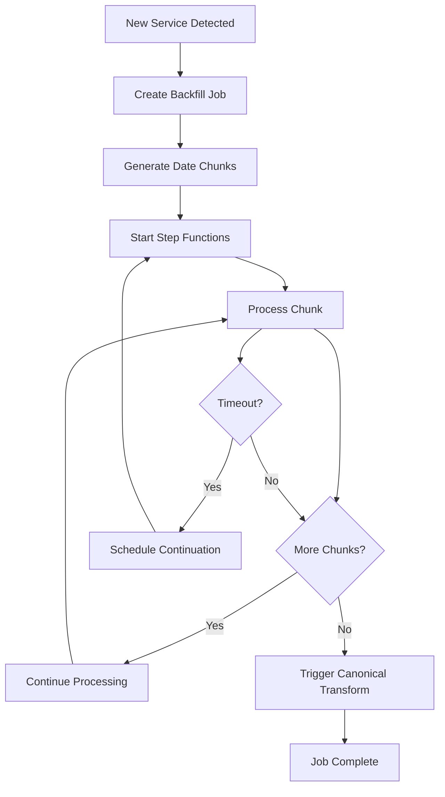

# Backfill Strategy for New Tenant Service Connections

This document outlines the comprehensive backfilling strategy for when tenants connect new services to the AVESA data pipeline for the first time.

## Overview

When a tenant connects a new service (e.g., ConnectWise, ServiceNow, Salesforce), we need to backfill historical data to provide complete data coverage. The backfill system is designed to handle large volumes of historical data efficiently while maintaining system performance and reliability.

## Architecture Components

### 1. Backfill Lambda Function (`src/backfill/lambda_function.py`)
- **Purpose**: Core backfill processing engine
- **Features**:
  - Chunked processing to avoid Lambda timeouts
  - Progress tracking and resumable operations
  - Rate limiting and error handling
  - Automatic canonical transformation triggering
- **Execution Model**: Processes data in configurable date chunks (default: 30 days)

### 2. Backfill Initiator Lambda (`src/backfill/initiator.py`)
- **Purpose**: Detects new services and initiates backfill jobs
- **Features**:
  - Automatic detection of new tenant services
  - Manual backfill triggering via API/events
  - Validation of tenant configurations
  - Step Functions orchestration
- **Triggers**: Scheduled execution, manual invocation, or event-driven

### 3. Step Functions State Machine
- **Purpose**: Orchestrates long-running backfill operations
- **Features**:
  - Handles Lambda timeout limitations
  - Automatic retry and continuation logic
  - Progress monitoring and alerting
  - Maximum 24-hour execution window

### 4. DynamoDB Backfill Jobs Table
- **Purpose**: Tracks backfill job progress and state
- **Schema**:
  ```
  job_id (PK) | tenant_id | service | status | total_chunks | completed_chunks | chunks[]
  ```
- **Indexes**: GSI on tenant_id + status for efficient querying

## Backfill Process Flow



## Configuration

### Service-Specific Settings (`mappings/backfill_config.json`)

```json
{
  "service_settings": {
    "connectwise": {
      "default_lookback_days": 730,
      "chunk_size_days": 30,
      "rate_limit_requests_per_minute": 200,
      "priority_endpoints": ["service/tickets", "time/entries"]
    },
    "servicenow": {
      "default_lookback_days": 365,
      "chunk_size_days": 14,
      "rate_limit_requests_per_minute": 100
    }
  }
}
```

### Tenant Overrides
- Tenants can have custom backfill settings
- Override default lookback periods
- Adjust chunk sizes for performance optimization

## Detection Logic

### Automatic Detection
The system automatically detects new services that need backfilling by:

1. **Service Configuration Check**: Verifies if tenant has service credentials configured
2. **Backfill History Check**: Checks if backfill has been completed previously
3. **Data Freshness Check**: Analyzes existing data to determine if service is newly connected
4. **Age Analysis**: Considers services with data less than 7 days old as "new"

### Manual Triggering
Backfills can be manually triggered using:

```bash
# Trigger backfill for specific tenant/service
python scripts/trigger-backfill.py \
  --tenant-id "tenant123" \
  --service "connectwise" \
  --start-date "2023-01-01T00:00:00Z" \
  --chunk-size-days 30

# Auto-detect services needing backfill
python scripts/trigger-backfill.py --auto-detect
```

## Chunking Strategy

### Date-Based Chunking
- **Default Chunk Size**: 30 days
- **Rationale**: Balances API rate limits, Lambda execution time, and memory usage
- **Configurable**: Can be adjusted per service or tenant

### Chunk Processing
1. **Sequential Processing**: Chunks processed one at a time to respect rate limits
2. **Progress Tracking**: Each chunk status tracked in DynamoDB
3. **Retry Logic**: Failed chunks retried up to 3 times
4. **Resumable**: Jobs can be resumed from last successful chunk

## Error Handling and Resilience

### Lambda Timeout Handling
- **Timeout Detection**: Monitors remaining execution time
- **Graceful Continuation**: Schedules new Lambda execution before timeout
- **State Preservation**: Progress saved to DynamoDB before continuation

### API Rate Limiting
- **Service-Specific Limits**: Configured per service (ConnectWise: 200 req/min)
- **Exponential Backoff**: Automatic retry with increasing delays
- **Circuit Breaker**: Temporary suspension on repeated failures

### Data Quality Assurance
- **Duplicate Detection**: Filters out already-processed records
- **Schema Validation**: Validates data structure before storage
- **Metadata Enrichment**: Adds backfill tracking metadata to records

## Performance Optimization

### Concurrent Execution Limits
- **Max Concurrent Backfills**: 5 simultaneous jobs
- **Tenant Isolation**: Prevents one tenant from overwhelming system
- **Resource Management**: Balances backfill with regular ingestion

### Memory and Storage Optimization
- **Streaming Processing**: Processes data in batches to minimize memory usage
- **Parquet Compression**: Efficient storage format for historical data
- **S3 Lifecycle Policies**: Automatic data archival for cost optimization

## Monitoring and Alerting

### Progress Tracking
- **Real-time Updates**: Progress updated every 10 chunks
- **CloudWatch Metrics**: Custom metrics for backfill progress
- **Dashboard Integration**: Visual progress tracking in monitoring stack

### Alerting Thresholds
- **Failure Rate**: Alert if >3 consecutive chunk failures
- **Execution Time**: Alert if job exceeds 20 hours
- **Completion Rate**: Alert if completion rate drops below 90%

## Data Flow Integration

### Raw Data Storage
```
s3://{bucket}/{tenant_id}/raw/{service}/{table_name}/{timestamp}.parquet
```

### Canonical Transformation
- **Automatic Triggering**: Canonical transform triggered after backfill completion
- **Backfill Mode**: Special processing mode for historical data
- **SCD Type 2**: Maintains historical accuracy with proper effective dates

### Incremental Sync Integration
- **Last Updated Tracking**: Updates incremental sync markers after backfill
- **Seamless Transition**: Smooth handoff from backfill to regular sync
- **Gap Prevention**: Ensures no data gaps between backfill and incremental sync

## Deployment and Operations

### Infrastructure Deployment
```bash
cd infrastructure
cdk deploy ConnectWiseBackfill-{environment}
```

### Operational Commands

```bash
# Monitor backfill progress
aws logs tail /aws/lambda/avesa-backfill-{env} --follow

# Check job status
aws dynamodb scan --table-name BackfillJobs-{env} \
  --filter-expression "tenant_id = :tid" \
  --expression-attribute-values '{":tid":{"S":"tenant123"}}'

# Manual job resumption
aws lambda invoke --function-name avesa-backfill-{env} \
  --payload '{"resume_job_id":"backfill_tenant123_connectwise_20240101"}' \
  response.json
```

### Cleanup and Maintenance
- **Completed Job Cleanup**: Automatic cleanup after 30 days
- **Failed Job Analysis**: Regular review of failed jobs for pattern analysis
- **Performance Tuning**: Periodic adjustment of chunk sizes and rate limits

## Best Practices

### When to Use Backfill
1. **New Tenant Onboarding**: First-time service connection
2. **Service Reactivation**: Re-enabling previously disabled services
3. **Data Recovery**: Recovering from extended outages
4. **Historical Analysis**: One-time historical data requirements

### Scheduling Considerations
- **Off-Peak Hours**: Schedule during low-activity periods (10 PM - 6 AM)
- **Business Impact**: Coordinate with tenant business hours
- **Resource Availability**: Ensure sufficient AWS service limits

### Data Validation
- **Pre-Backfill Validation**: Verify service connectivity and credentials
- **Post-Backfill Verification**: Validate data completeness and quality
- **Reconciliation**: Compare record counts with source system

## Troubleshooting Guide

### Common Issues

1. **API Rate Limit Exceeded**
   - **Symptoms**: 429 HTTP errors, slow progress
   - **Solution**: Reduce chunk size, increase delays between requests

2. **Lambda Timeout**
   - **Symptoms**: Incomplete chunks, timeout errors
   - **Solution**: Reduce chunk size, optimize processing logic

3. **Memory Exhaustion**
   - **Symptoms**: Out of memory errors, slow performance
   - **Solution**: Increase Lambda memory, reduce batch sizes

4. **Authentication Failures**
   - **Symptoms**: 401/403 errors, credential errors
   - **Solution**: Verify credentials, check service configuration

### Diagnostic Commands

```bash
# Check backfill job details
aws dynamodb get-item --table-name BackfillJobs-{env} \
  --key '{"job_id":{"S":"job_id_here"}}'

# Monitor Lambda execution
aws logs filter-log-events \
  --log-group-name /aws/lambda/avesa-backfill-{env} \
  --filter-pattern "ERROR"

# Check Step Functions execution
aws stepfunctions describe-execution \
  --execution-arn "arn:aws:states:region:account:execution:BackfillOrchestrator-{env}:execution_name"
```

## Future Enhancements

### Planned Improvements
1. **Parallel Chunk Processing**: Process multiple chunks simultaneously
2. **Smart Chunking**: Dynamic chunk size adjustment based on data volume
3. **Cross-Service Dependencies**: Handle dependencies between services
4. **Advanced Scheduling**: More sophisticated scheduling algorithms
5. **Cost Optimization**: Spot instance usage for large backfills

### Extensibility
- **New Service Support**: Framework designed for easy service addition
- **Custom Processing**: Pluggable processing logic for special requirements
- **Integration Points**: APIs for external system integration