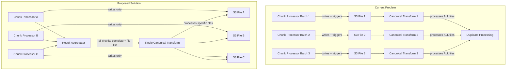

# Canonical Transform Architecture Fix

## Problem Analysis

### Current Race Condition Issue
The current architecture causes duplicate processing because:

1. **Per-Batch Triggering**: Each chunk processor writes to S3 and immediately triggers canonical transform
2. **Time-Based File Discovery**: Canonical transform looks at ALL files within a 72-hour window instead of specific files
3. **Multiple Overlapping Transforms**: Multiple canonical transforms run simultaneously, processing the same files

### Code Evidence
**Chunk Processor (lines 667-691):**
```python
# After EACH batch write to S3, triggers canonical transform immediately
canonical_success = self._trigger_canonical_transformation(
    tenant_id=tenant_id,
    service_name=service_name,
    table_name=table_name,
    s3_key=s3_key  # Only passes THIS batch's S3 key
)
```

**Canonical Transform (lines 434-442):**
```python
# Looks at ALL files in last 72 hours, not just the triggered file
recent_files = []
cutoff_time = datetime.now(timezone.utc).timestamp() - (72 * 60 * 60)  # 72 hours ago

for obj in response['Contents']:
    if obj['LastModified'].timestamp() > cutoff_time:
        recent_files.append(obj['Key'])  # Processes ALL recent files!
```

## Solution Architecture

### Proposed Flow


## Implementation Plan

### Phase 1: Modify Chunk Processor
**File**: `src/optimized/processors/chunk_processor.py`

**Changes Needed**:
1. **Remove Canonical Transform Triggering** (lines 667-691, 763-797)
   - Remove `_trigger_canonical_transformation()` calls from `_write_batch_to_s3()` and `_write_to_s3()`
   - Keep S3 file writing functionality
   - Return S3 file paths in processing results

2. **Enhanced Result Tracking**
   - Add `s3_files_written` to chunk completion response
   - Include table metadata for aggregator

**Expected Result**: Chunk processors only write to S3, no canonical transform triggering

### Phase 2: Enhance Result Aggregator
**File**: `src/optimized/helpers/result_aggregator.py`

**Changes Needed**:
1. **Add Canonical Transform Coordination**
   - New method: `_trigger_table_canonical_transforms()`
   - Collect S3 files from all completed chunks per table
   - Trigger canonical transform once per table with specific file list

2. **File Collection Logic**
   - Parse chunk results to extract `s3_files_written`
   - Group files by `(tenant_id, service_name, table_name)`
   - Create file-specific canonical transform payloads

3. **Integration Point**
   - Call canonical transform triggering after job completion update
   - Only trigger if all chunks completed successfully

### Phase 3: Modify Canonical Transform
**File**: `src/canonical_transform/lambda_function.py`

**Changes Needed**:
1. **Add Specific File Processing Mode**
   - New parameter: `source_files` (list of S3 keys)
   - When provided, skip time-based file discovery
   - Process only the specified files

2. **Backward Compatibility**
   - Maintain existing time-based discovery as default
   - Use `source_files` when available in event payload

3. **Enhanced Logging**
   - Log which files are being processed
   - Distinguish between time-based and file-specific modes

## Detailed Code Changes

### 1. Chunk Processor Changes

**Remove these methods/calls**:
- Lines 667-691: Remove canonical transform triggering from `_write_batch_to_s3()`
- Lines 763-797: Remove canonical transform triggering from `_write_to_s3()`
- Lines 852-948: Remove `_trigger_canonical_transformation()` method entirely

**Enhance response payload**:
```python
# In _process_chunk() return value (line 413-421)
result = {
    'completed': completed,
    'records_processed': records_processed,
    'processing_time': processing_time,
    'final_page': current_page,
    'final_offset': current_offset,
    's3_files_written': s3_files_written,  # Already exists
    's3_files_count': len(s3_files_written),
    # Add table metadata for aggregator
    'table_metadata': {
        'tenant_id': chunk_config['tenant_id'],
        'service_name': table_config['service_name'],
        'table_name': table_config['table_name']
    }
}
```

### 2. Result Aggregator Changes

**Add new method**:
```python
def _trigger_table_canonical_transforms(self, job_id: str, results: Dict[str, Any]):
    """
    Trigger canonical transforms for all tables that had chunks processed.
    
    Args:
        job_id: Processing job identifier
        results: Aggregated results containing chunk data
    """
    try:
        # Collect S3 files by table
        table_files = {}  # (tenant_id, service_name, table_name) -> [s3_files]
        
        # Parse results to extract chunk data with S3 files
        chunk_data = self._extract_chunk_data_from_results(results)
        
        for chunk in chunk_data:
            table_key = (
                chunk['tenant_id'],
                chunk['service_name'], 
                chunk['table_name']
            )
            
            if table_key not in table_files:
                table_files[table_key] = []
            
            table_files[table_key].extend(chunk['s3_files_written'])
        
        # Trigger canonical transform for each table
        lambda_client = boto3.client('lambda', region_name='us-east-2')
        
        for (tenant_id, service_name, table_name), s3_files in table_files.items():
            if s3_files:  # Only trigger if files were written
                self._trigger_single_canonical_transform(
                    lambda_client, tenant_id, service_name, table_name, s3_files
                )
                
    except Exception as e:
        self.logger.error(f"Failed to trigger canonical transforms: {str(e)}")
```

**Integrate into completion flow**:
```python
# In _update_job_completion() method, after successful update
if status in ['completed', 'partial_success']:
    # Trigger canonical transforms for completed chunks
    self._trigger_table_canonical_transforms(job_id, results)
```

### 3. Canonical Transform Changes

**Add specific file processing**:
```python
# In lambda_handler(), add parameter parsing
source_files = event.get('source_files')  # List of specific S3 keys
processing_mode = 'file_specific' if source_files else 'time_based'

self.logger.info(f"Canonical transform starting in {processing_mode} mode",
                processing_mode=processing_mode,
                source_files_count=len(source_files) if source_files else 0)
```

**Modify file discovery logic**:
```python
# Replace time-based discovery when source_files provided
if source_files:
    # Process only specified files
    recent_files = source_files
    self.logger.info(f"Using specified source files", file_count=len(recent_files))
else:
    # Use existing time-based discovery
    recent_files = []
    cutoff_time = datetime.now(timezone.utc).timestamp() - (72 * 60 * 60)
    # ... existing logic
```

## Benefits

### 1. Eliminates Race Conditions
- ✅ Single canonical transform trigger per table
- ✅ No overlapping processing windows
- ✅ Deterministic file processing

### 2. Improves Performance
- ✅ Reduced Lambda invocations (1 per table vs N per chunk)
- ✅ Eliminated duplicate processing overhead
- ✅ More efficient resource utilization

### 3. Enhances Reliability
- ✅ Atomic processing per table
- ✅ Clear dependency chain
- ✅ Better error isolation

### 4. Maintains Compatibility
- ✅ Existing canonical transform still works for manual triggers
- ✅ Backward compatible parameter handling
- ✅ No breaking changes to existing flows

## Testing Strategy

### 1. Unit Tests
- Test chunk processor returns correct S3 file metadata
- Test result aggregator groups files correctly by table
- Test canonical transform processes specific files only

### 2. Integration Tests
- End-to-end pipeline with multiple chunks per table
- Verify single canonical transform per table
- Confirm no duplicate processing

### 3. Performance Tests
- Compare before/after Lambda invocation counts
- Measure processing time improvements
- Validate resource utilization

## Rollback Plan

If issues arise:
1. **Immediate**: Revert chunk processor to trigger canonical transforms (restore lines 667-691, 763-797)
2. **Medium-term**: Add feature flag to toggle between old and new behavior
3. **Investigation**: Use enhanced logging to debug any integration issues

## Next Steps

1. **Review and Approve**: User reviews this plan
2. **Implementation**: Execute changes in order (Chunk → Aggregator → Canonical)
3. **Testing**: Verify functionality at each step
4. **Deployment**: Deploy and monitor in development environment
5. **Validation**: Confirm elimination of race conditions

Would you like me to proceed with implementing these changes?