# 🔧 **CLICKHOUSE DEDUPLICATION FIX PLAN (REVISED)**

## **Problem Analysis**

**Root Cause**: Critical deduplication gap causing data quality issues:
1. Tables use basic `MergeTree()` instead of `ReplacingMergeTree()` 
2. Data loader performs straight `INSERT` with zero deduplication logic
3. Every canonical transform run creates duplicates
4. Lambda retries and re-runs compound the problem

## **Solution Architecture (SIMPLIFIED)**

```mermaid
graph TD
    A[Canonical Transform] --> B[Parquet File in S3]
    B --> C[ClickHouse Data Loader]
    
    subgraph "CURRENT (BROKEN)"
        C --> D[Direct INSERT]
        D --> E[MergeTree Table]
        E --> F[❌ DUPLICATES CREATED]
    end
    
    subgraph "FIXED APPROACH (SIMPLIFIED)"
        C --> G[Direct INSERT]
        G --> H[ReplacingMergeTree Table]
        H --> I[ORDER BY tenant_id, id, last_updated]
        I --> J[✅ Native Deduplication via last_updated]
        J --> K[Periodic OPTIMIZE for Cleanup]
    end
```



## **Revised Implementation Plan: 1-Phase Approach**

### **Phase 1: Engine Change Only (IMMEDIATE - 30 minutes)**

**1.1 Update Table Engine to ReplacingMergeTree**
- Modify [`dynamic_schema_manager.py`](src/clickhouse/schema_init/dynamic_schema_manager.py:128)
- Change from `ENGINE = MergeTree()` to `ENGINE = ReplacingMergeTree(last_updated)`
- Keep existing `ORDER BY (tenant_id, id, last_updated)` - no partitioning changes
- Use `last_updated` as version column for automatic deduplication

**1.2 No Data Loader Changes Required**
- ReplacingMergeTree handles deduplication automatically
- ORDER BY ensures proper sorting for deduplication
- `last_updated` version column ensures latest records are kept

**1.3 Remove Canonical Transform Deduplication**
- Since chunk processors already handle unique records within chunks
- ReplacingMergeTree handles cross-chunk deduplication automatically

## **Detailed Implementation**

### **Schema Manager Fix**

**File**: [`src/clickhouse/schema_init/dynamic_schema_manager.py`](src/clickhouse/schema_init/dynamic_schema_manager.py:128)

```python
# BEFORE (lines 128-130):
ENGINE = MergeTree()
ORDER BY (tenant_id, id, {'effective_start_date' if scd_type == 'type_2' else 'last_updated'})
SETTINGS index_granularity = 8192

# AFTER:
ENGINE = ReplacingMergeTree(last_updated)
ORDER BY (tenant_id, id, {'effective_start_date' if scd_type == 'type_2' else 'last_updated'})
SETTINGS index_granularity = 8192
```

**Benefits**:
- Native ClickHouse deduplication using `last_updated` as version column
- No partitioning changes (following ClickHouse best practices)
- Existing ORDER BY optimized for deduplication
- ClickHouse automatically keeps latest version during merges
- Zero application-level deduplication logic required

### **How ReplacingMergeTree Deduplication Works**

1. **Insertion**: Records inserted normally with same `id` but different `last_updated`
2. **Background Merges**: ClickHouse periodically merges parts 
3. **Deduplication**: During merges, records with same ORDER BY key are deduplicated
4. **Version Selection**: Record with highest `last_updated` value is kept
5. **Cleanup**: Old versions automatically removed

### **Example Scenario**:
```sql
-- Insert 1: Initial record
INSERT INTO companies VALUES ('company_1', 'ACME Corp', '2025-01-01 10:00:00');

-- Insert 2: Updated record (same id, newer last_updated)
INSERT INTO companies VALUES ('company_1', 'ACME Corporation', '2025-01-02 15:30:00');

-- After OPTIMIZE: Only latest record remains
-- Result: ('company_1', 'ACME Corporation', '2025-01-02 15:30:00')
```

## **Migration Steps**

### **Development Environment**
```bash
# 1. Update schema manager code
# 2. Recreate tables with new engine
python -c "
from src.clickhouse.schema_init.dynamic_schema_manager import DynamicClickHouseSchemaManager, get_clickhouse_client
client = get_clickhouse_client()
manager = DynamicClickHouseSchemaManager(client)
manager.recreate_table_with_ordered_schema('companies')
"

# 3. Test canonical transform multiple times
# 4. Verify no duplicates created
```

### **Production Environment**
```bash
# 1. Backup existing data
# 2. Apply schema changes during maintenance window
# 3. Run OPTIMIZE to trigger initial deduplication
# 4. Monitor performance and data integrity
```

## **Expected Outcomes**

### **Immediate Benefits**:
- ✅ **Zero new duplicates** - ReplacingMergeTree handles all deduplication
- ✅ **No application changes** - Pure engine-level solution
- ✅ **Lambda retry safety** - Multiple executions create no issues
- ✅ **Performance improvement** - Reduced storage and query overhead
- ✅ **Simplified architecture** - No custom deduplication logic

### **Data Quality Metrics**:
- **Before**: Every canonical transform = 100% duplicate rate
- **After**: Every canonical transform = 0% duplicate rate  
- **Storage**: Immediate reduction in table sizes after OPTIMIZE
- **Query Performance**: Faster analytics due to automatic deduplication

## **Risk Mitigation**

### **Zero Risk Changes**:
- Engine change is backward compatible
- ReplacingMergeTree is production-proven
- No application logic changes required
- Existing queries work unchanged

### **Rollback Plan**:
- Can revert to MergeTree if needed
- Data remains intact during engine changes
- Gradual deployment: dev → staging → production

## **Testing Strategy**

### **1. Deduplication Validation**:
```sql
-- Test: Insert same record multiple times
INSERT INTO companies SELECT * FROM companies WHERE id = 'test_company';
INSERT INTO companies SELECT * FROM companies WHERE id = 'test_company';

-- Run OPTIMIZE to trigger deduplication
OPTIMIZE TABLE companies;

-- Verify: Only one record remains
SELECT count(*) FROM companies WHERE id = 'test_company';
-- Expected: 1
```

### **2. Version Column Testing**:
```sql
-- Test: Insert older version after newer version
-- Verify: Newer version is kept after OPTIMIZE
```

### **3. Performance Testing**:
```sql
-- Compare query performance before/after
-- Measure storage usage reduction
```

## **Commands for Implementation**

### **1. Update Schema Manager**
```python
# File: src/clickhouse/schema_init/dynamic_schema_manager.py
# Line 128: Change ENGINE to ReplacingMergeTree(last_updated)
```

### **2. Recreate Tables**
```python
# Development testing
manager.recreate_table_with_ordered_schema('companies')
manager.recreate_table_with_ordered_schema('contacts') 
manager.recreate_table_with_ordered_schema('tickets')
manager.recreate_table_with_ordered_schema('time_entries')
```

### **3. Trigger Deduplication**
```sql
-- After migration, trigger optimization
OPTIMIZE TABLE companies;
OPTIMIZE TABLE contacts;
OPTIMIZE TABLE tickets; 
OPTIMIZE TABLE time_entries;
```

## **Success Criteria**

1. ✅ All tables use `ReplacingMergeTree(last_updated)` engine
2. ✅ Multiple canonical transform runs create zero duplicates
3. ✅ Lambda retries cause no data duplication
4. ✅ Query performance maintained or improved
5. ✅ Storage usage reduced after optimization

## **Post-Implementation**

### **Monitoring**:
- Track table sizes after optimization
- Monitor merge performance 
- Validate data quality metrics

### **Maintenance**:
- Periodic `OPTIMIZE` commands for immediate deduplication
- Monitor ClickHouse background merge activity
- Set up automated optimization schedules if needed

This **simplified approach** leverages ClickHouse's native deduplication capabilities without requiring complex application-level logic, making it both more reliable and easier to maintain.