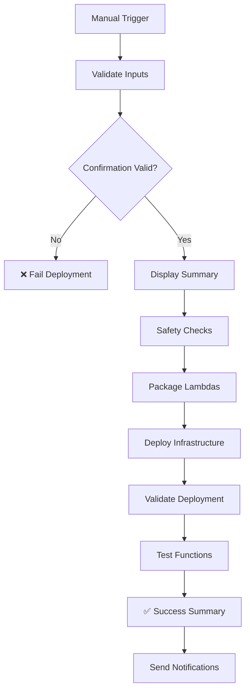

# AVESA Comprehensive Deployment Guide

This guide covers all deployment scenarios for the AVESA Multi-Tenant Data Pipeline, including development environment setup, manual production deployment, and automated deployment procedures.

## Table of Contents

1. [Overview](#overview)
2. [Prerequisites](#prerequisites)
3. [Quick Start](#quick-start)
4. [Development Environment Setup](#development-environment-setup)
5. [Manual Production Deployment](#manual-production-deployment)
6. [Automated Deployment](#automated-deployment)
7. [Post-Deployment Setup](#post-deployment-setup)
8. [Monitoring and Troubleshooting](#monitoring-and-troubleshooting)
9. [Security Considerations](#security-considerations)
10. [Advanced Configuration](#advanced-configuration)

## Overview

AVESA supports multiple deployment scenarios:

- **Development Environment**: Local testing and development with optimized architecture
- **Staging Environment**: Pre-production testing environment
- **Production Environment**: Manual deployment with safety controls and audit trails
- **Automated Deployment**: CI/CD pipeline deployment via GitHub Actions

**Architecture**: The system uses an optimized parallel processing architecture with multi-level coordination via Step Functions.

## Prerequisites

Before deploying AVESA, ensure you have the following installed and configured:

1. **AWS CLI** - [Installation Guide](https://docs.aws.amazon.com/cli/latest/userguide/getting-started-install.html)
2. **Node.js 18+** - Required for AWS CDK
3. **Python 3.9+** - For Lambda functions and deployment scripts
4. **AWS CDK CLI** - Install globally: `npm install -g aws-cdk`

### AWS Account Setup

AVESA uses a hybrid account strategy:

- **Development/Staging**: Uses your default AWS account or specified profile
- **Production**: Uses dedicated production account with `avesa-production` profile

## Quick Start

### 1. Clone and Setup

```bash
git clone <repository-url>
cd avesa
pip install -r requirements.txt
```

### 2. Deploy to Development

```bash
./scripts/deploy.sh --environment dev
```

### 3. Deploy to Staging

```bash
./scripts/deploy.sh --environment staging
```

### 4. Deploy to Production

```bash
./scripts/deploy.sh --environment prod
```

## Development Environment Setup

### Overview

The AVESA optimized data pipeline consists of:
- **Pipeline Orchestrator**: Main entry point using Step Functions for workflow coordination
- **Tenant Processor**: Handles tenant-level processing with parallel table execution
- **Table Processor**: Manages table-level processing with intelligent chunking
- **Chunk Processor**: Processes individual data chunks with timeout handling
- **Enhanced DynamoDB Tables**: Store tenant configurations, job tracking, and chunk progress
- **S3 Buckets**: Store raw and canonical data in optimized Parquet format
- **Secrets Manager**: Store API credentials securely
- **CloudWatch Monitoring**: Comprehensive metrics and dashboards for performance tracking

### Step 1: Deploy Dev Environment Infrastructure

```bash
# Deploy complete dev environment infrastructure using optimized CDK
./scripts/deploy.sh --environment dev --region us-east-2
```

This script will:
- ✅ Create `TenantServices-dev` and `LastUpdated-dev` DynamoDB tables
- ✅ Create `ProcessingJobs-dev` and `ChunkProgress-dev` tables for job tracking
- ✅ Create `data-storage-msp-dev` S3 bucket
- ✅ Deploy optimized Lambda functions with lightweight packaging
- ✅ Deploy Step Functions state machines for workflow orchestration
- ✅ Upload mapping configurations to S3
- ✅ Set up EventBridge scheduling rules
- ✅ Configure IAM roles and policies
- ✅ Create CloudWatch dashboards and monitoring

### Step 2: Create a Test Tenant with Service

```bash
# Add ConnectWise service to a tenant (creates tenant automatically if it doesn't exist)
python scripts/setup-service.py \
  --tenant-id "{tenant-id}" \
  --company-name "Test Company" \
  --service connectwise \
  --environment dev \
  --region us-east-2
```

This will:
- ✅ Create a test tenant in DynamoDB (if it doesn't exist)
- ✅ Store test ConnectWise credentials in Secrets Manager
- ✅ Configure the tenant for optimized data ingestion
- ✅ Enable the tenant for the new parallel processing pipeline

### Step 3: Test the Optimized Pipeline

```bash
# Run comprehensive tests for optimized pipeline
python scripts/test-lambda-functions.py --environment dev --region us-east-2 --verbose

# Test end-to-end pipeline with optimized architecture
python scripts/test-end-to-end-pipeline.py --environment dev --region us-east-2

# Test Step Functions workflow
aws stepfunctions start-execution \
  --state-machine-arn "arn:aws:states:us-east-2:ACCOUNT:stateMachine:PipelineOrchestrator-dev" \
  --input '{"tenant_id": "{tenant-id}", "table_name": "service/tickets"}'
```

### Manual Testing Commands

#### Test Optimized Pipeline Orchestrator

```bash
# Start optimized pipeline execution via Step Functions
aws stepfunctions start-execution \
  --state-machine-arn "arn:aws:states:us-east-2:ACCOUNT:stateMachine:PipelineOrchestrator-dev" \
  --input '{"tenant_id": "{tenant-id}", "table_name": "service/tickets"}' \
  --region us-east-2

# Monitor Step Functions execution
aws stepfunctions describe-execution \
  --execution-arn "EXECUTION_ARN" \
  --region us-east-2

# Test individual Lambda components
aws lambda invoke \
  --function-name avesa-pipeline-orchestrator-dev \
  --payload '{"tenant_id": "{tenant-id}"}' \
  --cli-binary-format raw-in-base64-out \
  response.json --region us-east-2

# Monitor optimized pipeline logs
aws logs tail /aws/lambda/avesa-pipeline-orchestrator-dev --follow --region us-east-2
aws logs tail /aws/lambda/avesa-tenant-processor-dev --follow --region us-east-2
```

#### Check Data Storage

```bash
# List S3 data
aws s3 ls s3://data-storage-msp-dev/ --recursive --region us-east-2

# Check DynamoDB data
aws dynamodb scan --table-name TenantServices-dev --region us-east-2
aws dynamodb scan --table-name LastUpdated-dev --region us-east-2

# Check optimized pipeline tracking tables
aws dynamodb scan --table-name ProcessingJobs-dev --region us-east-2
aws dynamodb scan --table-name ChunkProgress-dev --region us-east-2

# Check secrets
aws secretsmanager list-secrets --filters Key=name,Values={tenant-id}/ --region us-east-2

# Monitor CloudWatch dashboards
aws cloudwatch get-dashboard --dashboard-name "AVESA-Pipeline-Overview-dev" --region us-east-2
```

## Manual Production Deployment

### Overview

Production deployments are **manually controlled** and require explicit confirmation to prevent accidental deployments. This process uses GitHub Actions workflow with enhanced safety checks.

### Key Safety Features

#### ❌ What's Removed
- **Automatic deployments** on push to main branch
- **No safety confirmations** required
- **Limited audit trail**

#### ✅ What's Added
- **Manual trigger only** through GitHub Actions UI
- **Explicit confirmation** required ("DEPLOY TO PRODUCTION")
- **Deployment reason** for audit trail
- **Component selection** (all, infrastructure-only, lambdas-only)
- **Enhanced safety checks** and validation
- **Comprehensive audit logging**
- **Optimized architecture deployment** with performance monitoring
- **Step Functions workflow deployment** for parallel processing

### How to Deploy to Production

#### Step 1: Navigate to GitHub Actions
1. Go to your repository on GitHub
2. Click on the **Actions** tab
3. Select **Deploy to Production** workflow
4. Click **Run workflow** button

#### Step 2: Fill Required Parameters

##### 🔐 Deployment Confirmation
- **Field:** `deployment_confirmation`
- **Required:** Type exactly `DEPLOY TO PRODUCTION`
- **Purpose:** Prevents accidental deployments

##### 🎯 Environment Target
- **Field:** `environment_target`
- **Required:** Select `production`
- **Purpose:** Confirms target environment

##### 📝 Deployment Reason
- **Field:** `deployment_reason`
- **Required:** Provide clear reason for deployment
- **Examples:**
  - "Deploy new ConnectWise integration features"
  - "Fix critical bug in data transformation"
  - "Update Lambda optimization for pandas layer"

##### 🔧 Components to Deploy
- **Field:** `components_to_deploy`
- **Options:**
  - `all` - Deploy optimized infrastructure, Lambda functions, and Step Functions
  - `infrastructure-only` - Deploy only CDK infrastructure (includes Step Functions state machines)
  - `lambdas-only` - Deploy only optimized Lambda functions
- **Default:** `all`

##### ⚡ Force Deploy
- **Field:** `force_deploy`
- **Optional:** Check if you want to force deployment
- **Default:** `false`

#### Step 3: Review and Execute
1. **Double-check all parameters**
2. **Verify deployment reason is clear**
3. **Click "Run workflow"**
4. **Monitor the deployment progress**

### Deployment Process Flow



### Safety Features

#### 🔒 Pre-Deployment Validation
- Confirms exact deployment confirmation text
- Validates environment target
- Requires deployment reason
- Verifies AWS account identity

#### 📊 Deployment Summary
- Shows all deployment parameters
- Displays AWS account and region
- Includes timestamp and commit hash
- Provides audit trail

#### 🔍 Post-Deployment Validation
- Lists deployed optimized Lambda functions (orchestrator, processors)
- Checks DynamoDB table status (including ProcessingJobs and ChunkProgress tables)
- Verifies S3 bucket access
- Tests Step Functions state machine execution
- Validates CloudWatch dashboard creation
- Tests Lambda function execution and monitoring

### Audit Trail

Every deployment creates a comprehensive audit trail including:

- **Who:** GitHub actor who triggered deployment
- **When:** UTC timestamp of deployment
- **Why:** Deployment reason provided
- **What:** Components deployed
- **Where:** AWS account and region
- **How:** Commit hash and workflow details

## Automated Deployment

### Optimized Deployment Script

The [`scripts/deploy.sh`](../scripts/deploy.sh) script provides a consistent deployment experience across all environments using the optimized architecture.

### Usage

```bash
./scripts/deploy.sh [OPTIONS]

Options:
  -e, --environment ENVIRONMENT    Environment to deploy (dev, staging, prod) [REQUIRED]
  -r, --region REGION             AWS region [default: us-east-2]
  -p, --profile PROFILE           AWS profile to use [auto-detected based on environment]
  -h, --help                      Show help message

Examples:
  ./scripts/deploy.sh --environment dev
  ./scripts/deploy.sh --environment prod --region us-west-2
  ./scripts/deploy.sh -e staging -p my-aws-profile
```

### Environment-Specific Configuration

The script automatically configures environment-specific settings:

#### Development/Staging
- **AWS Profile**: Uses `AdministratorAccess-YOUR_DEV_ACCOUNT_ID` or specified profile
- **Account Variable**: `CDK_DEFAULT_ACCOUNT`
- **Resource Naming**: Resources suffixed with `-{environment}`
- **S3 Bucket**: `data-storage-msp-{environment}`
- **DynamoDB Tables**: `TenantServices-{environment}`, `LastUpdated-{environment}`

#### Production
- **AWS Profile**: Uses `avesa-production` (can be overridden)
- **Account Variable**: `CDK_PROD_ACCOUNT`
- **Resource Naming**: No suffix (clean production names)
- **S3 Bucket**: `data-storage-msp`
- **DynamoDB Tables**: `TenantServices`, `LastUpdated`

### Deployment Workflow

The unified script follows this consistent workflow for all environments:

#### 1. Prerequisites Validation
- Checks AWS CLI installation
- Verifies CDK CLI availability
- Confirms project structure
- Validates Python requirements

#### 2. Environment Configuration
- Sets appropriate AWS profile
- Configures account-specific environment variables
- Verifies AWS credentials and access
- Installs Python dependencies

#### 3. CDK Bootstrap
- Checks if CDK is bootstrapped in target region
- Bootstraps CDK if needed
- Uses environment-specific AWS profile

#### 4. Infrastructure Deployment
- Synthesizes CDK application with environment context using [`infrastructure/app.py`](../infrastructure/app.py)
- Deploys all CDK stacks including performance optimization stack
- Handles environment-specific resource naming

#### 5. Mapping File Upload
- Uploads canonical mapping files to S3
- Uploads integration endpoint configurations
- Uses environment-specific bucket naming

#### 6. Deployment Validation
- Verifies CloudFormation stacks
- Checks Lambda function creation
- Validates DynamoDB tables
- Confirms S3 bucket accessibility

## Post-Deployment Setup

### 1. Tenant Configuration

After successful deployment, set up tenants using the service setup script:

#### Setup ConnectWise Service for a Tenant
```bash
python scripts/setup-service.py \
  --tenant-id "{tenant-id}" \
  --company-name "Example Company" \
  --service connectwise \
  --environment dev
```

The script will prompt you for the required ConnectWise credentials:
- **company_id**: Your ConnectWise company identifier
- **public_key**: Your ConnectWise API public key
- **private_key**: Your ConnectWise API private key
- **client_id**: Your ConnectWise API client ID
- **api_base_url**: Your ConnectWise API base URL (e.g., "https://api-na.myconnectwise.net")

Alternatively, you can provide credentials via environment variables:
```bash
export CONNECTWISE_COMPANY_ID="YourCompanyID"
export CONNECTWISE_PUBLIC_KEY="your-public-key"
export CONNECTWISE_PRIVATE_KEY="your-private-key"
export CONNECTWISE_CLIENT_ID="your-client-id"
export CONNECTWISE_API_BASE_URL="https://api-na.myconnectwise.net"

python scripts/setup-service.py \
  --tenant-id "{tenant-id}" \
  --company-name "Example Company" \
  --service connectwise \
  --environment dev
```

### 2. Testing the Pipeline

Test the deployed pipeline:

```bash
# Test Lambda function
aws lambda invoke \
  --function-name avesa-connectwise-ingestion-dev \
  --payload '{"tenant_id": "{tenant-id}"}' \
  response.json \
  --profile AdministratorAccess-YOUR_DEV_ACCOUNT_ID

# Monitor logs
aws logs tail /aws/lambda/avesa-connectwise-ingestion-dev --follow --profile AdministratorAccess-YOUR_DEV_ACCOUNT_ID

# Check S3 data
aws s3 ls s3://data-storage-msp-dev/ --recursive --profile AdministratorAccess-YOUR_DEV_ACCOUNT_ID
```

## Monitoring and Troubleshooting

### CloudWatch Resources

After deployment, monitor your pipeline using:

- **Lambda Logs**: `/aws/lambda/avesa-*` log groups
- **Custom Metrics**: `AVESA/Pipeline` namespace
- **CloudWatch Dashboards**: Available in AWS Console

### Common Commands

```bash
# View tenant configurations
aws dynamodb scan --table-name TenantServices-dev --profile AdministratorAccess-YOUR_DEV_ACCOUNT_ID

# Get specific tenant service configuration
aws dynamodb get-item \
  --table-name TenantServices-dev \
  --key '{"tenant_id":{"S":"{tenant-id}"},"service":{"S":"connectwise"}}' \
  --profile AdministratorAccess-YOUR_DEV_ACCOUNT_ID

# List tenant secrets
aws secretsmanager list-secrets --filters Key=name,Values={tenant-id}/ --profile AdministratorAccess-YOUR_DEV_ACCOUNT_ID

# Check deployment status
aws cloudformation list-stacks --stack-status-filter CREATE_COMPLETE UPDATE_COMPLETE --profile AdministratorAccess-YOUR_DEV_ACCOUNT_ID
```

### Troubleshooting Common Issues

#### CDK Bootstrap Required
```
Error: This stack uses assets, so the toolkit stack must be deployed
```
**Solution**: The script automatically handles CDK bootstrapping

#### Insufficient Permissions
```
Error: User is not authorized to perform: iam:CreateRole
```
**Solution**: Ensure your AWS credentials have sufficient permissions for CDK deployment

#### Profile Not Found
```
Error: AWS profile 'avesa-production' not configured
```
**Solution**: Configure the required AWS profile or specify a different one

#### Pydantic Import Errors
```
Error: No module named 'pydantic_core._pydantic_core'
```
**Solution**: Redeploy Lambda functions using the optimized deployment script
```bash
./scripts/deploy.sh --environment dev --region us-east-2
```

#### Missing DynamoDB Tables
```
Error: Requested resource not found
```
**Solution**: Deploy the dev environment infrastructure
```bash
./scripts/deploy.sh --environment dev --region us-east-2
```

#### Lambda Function Not Found
```
Error: Function not found
```
**Solution**: Deploy the optimized infrastructure first
```bash
cd infrastructure
cdk deploy --app "python app.py" --context environment=dev --all --region us-east-2
```

## Security Considerations

### Secrets Management
- ConnectWise credentials stored in AWS Secrets Manager
- Tenant-specific secret isolation
- Automatic secret rotation support

### IAM Security
- Lambda functions use least-privilege IAM roles
- Environment-specific resource access
- Cross-account role separation for production

### Data Encryption
- S3 buckets use AWS managed encryption
- DynamoDB tables encrypted at rest
- Secrets Manager automatic encryption

## Advanced Configuration

### Custom Regions

Deploy to different AWS regions:

```bash
./scripts/deploy.sh --environment prod --region us-west-2
```

### Custom Profiles

Use specific AWS profiles:

```bash
./scripts/deploy.sh --environment dev --profile my-custom-profile
```

### Environment Variables

The script sets these environment variables automatically:

- `AWS_PROFILE`: Active AWS profile
- `CDK_DEFAULT_REGION`: Target AWS region
- `CDK_DEFAULT_ACCOUNT` or `CDK_PROD_ACCOUNT`: Account ID

### AWS Profile Configuration

#### Development/Staging

For development and staging environments, configure the AdministratorAccess-YOUR_DEV_ACCOUNT_ID AWS profile:

```bash
aws configure --profile AdministratorAccess-YOUR_DEV_ACCOUNT_ID
```

Or use a specific profile:

```bash
aws configure --profile my-dev-profile
./scripts/deploy.sh --environment dev --profile my-dev-profile
```

#### Production

For production deployments, configure the `avesa-production` profile:

```bash
aws configure --profile avesa-production
```

Or set up cross-account role access:

```bash
aws configure set role_arn arn:aws:iam::YOUR_PRODUCTION_ACCOUNT_ID:role/DeploymentRole --profile avesa-production
aws configure set source_profile AdministratorAccess-YOUR_DEV_ACCOUNT_ID --profile avesa-production
```

## Rollback Procedures

### Emergency Rollback

To rollback a deployment:

```bash
# Destroy specific environment
cd infrastructure
cdk destroy --context environment=dev --all

# Or destroy specific stacks
cdk destroy AVESADataPipeline-dev
cdk destroy AVESAMonitoring-dev
```

### Partial Rollback

For partial rollbacks, redeploy with previous configuration:

```bash
git checkout <previous-commit>
./scripts/deploy.sh --environment dev
```

## Architecture Notes

### Data Flow
```
EventBridge → Pipeline Orchestrator (Step Functions) → Tenant Processor (Step Functions)
                                                              ↓
                                                    Table Processor (Step Functions)
                                                              ↓
                                                    Chunk Processor (Lambda) → S3 (Raw Parquet)
                                                              ↓
                                                    Canonical Transform → S3 (Canonical Parquet)
```

**Optimized Architecture Benefits:**
- Multi-level parallelization (tenant → table → chunk)
- Intelligent chunking with timeout handling
- Resumable processing with state persistence
- Comprehensive monitoring and progress tracking

### Storage Structure
```
s3://data-storage-msp-dev/
├── {tenant-id}/
│   ├── raw/
│   │   └── connectwise/
│   │       ├── service/tickets/
│   │       ├── time/entries/
│   │       ├── company/companies/
│   │       └── company/contacts/
│   └── canonical/
│       ├── tickets/
│       ├── time_entries/
│       ├── companies/
│       └── contacts/
└── mappings/
    ├── canonical/                # Canonical transformation mappings
    │   ├── tickets.json          # Canonical mapping for tickets
    │   ├── time_entries.json     # Canonical mapping for time entries
    │   ├── companies.json        # Canonical mapping for companies
    │   └── contacts.json         # Canonical mapping for contacts
    ├── backfill_config.json      # Backfill configuration
    └── integrations/
        └── connectwise_endpoints.json
```

## Support

For deployment issues:

1. Check the deployment logs for specific error messages
2. Verify AWS credentials and permissions
3. Ensure all prerequisites are installed
4. Review the troubleshooting section above

For additional support, refer to the project documentation or contact the development team.

---

**Last Updated:** December 2024  
**Maintained By:** AVESA DevOps Team