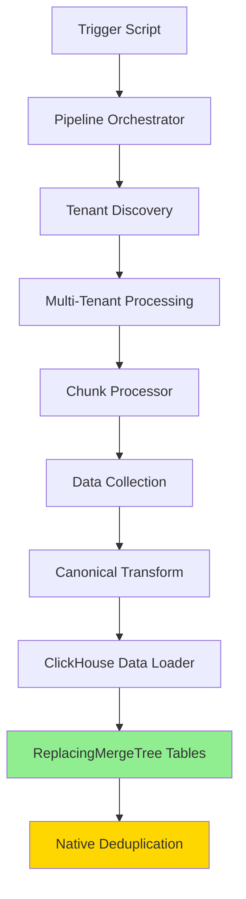

# Full Pipeline Trigger Plan for Deduplication Testing

## Overview

This document outlines the complete plan to trigger the pipeline for all tenants and all tables to test the ClickHouse deduplication fix. The ReplacingMergeTree implementation has been successfully deployed, and now we need to validate it works across the entire system.

## Architecture Flow



## Implementation Strategy

### Method 1: Direct Lambda Invocation (Recommended)

**Target Function:** `avesa-pipeline-orchestrator-{environment}`

**Payload Structure:**
```json
{
  "source": "manual_full_pipeline",
  "mode": "multi-tenant", 
  "process_all_tenants": true,
  "process_all_tables": true,
  "deduplication_test": true,
  "record_limit": 1000,
  "execution_context": {
    "purpose": "Test ClickHouse deduplication fix",
    "scope": "All tenants, all canonical tables",
    "expected_tables": ["companies", "contacts", "tickets", "time_entries"]
  }
}
```

### Method 2: AWS CLI Command

```bash
aws lambda invoke \
  --function-name avesa-pipeline-orchestrator-dev \
  --payload '{"source":"manual_full_pipeline","mode":"multi-tenant","process_all_tenants":true}' \
  --region us-east-2 \
  response.json
```

### Method 3: Backfill Initiator

**Target Function:** `avesa-backfill-initiator-{environment}`

**Payload:**
```json
{
  "action": "manual_trigger",
  "tenant_id": "ALL",
  "service": "connectwise",
  "table_name": "companies"
}
```

## Expected Execution Flow

### Phase 1: Initialization
1. **Orchestrator Invocation** - Pipeline orchestrator receives trigger
2. **Tenant Discovery** - Queries DynamoDB for all enabled tenants  
3. **Job Creation** - Creates processing job with unique ID
4. **Metrics Initialization** - Sends CloudWatch metrics

### Phase 2: Processing
1. **Async Chunk Processing** - Invokes chunk processor for each tenant
2. **Data Extraction** - Collects data from service APIs
3. **Canonical Transform** - Transforms to canonical format
4. **ClickHouse Loading** - Inserts with ReplacingMergeTree deduplication

### Phase 3: Validation
1. **Record Count Verification** - Compare before/after counts
2. **Deduplication Testing** - Run pipeline multiple times
3. **Version Validation** - Confirm latest records preserved

## Key Components Analysis

### Pipeline Orchestrator (`src/optimized/orchestrator/lambda_function.py`)

**Critical Functions:**
- `_discover_tenants()` (lines 317-363): Finds all enabled tenants
- `_execute_pipeline_workflow()` (lines 565-838): Triggers async processing
- `_format_tenant_config()` (lines 365-391): Formats tenant data

**Tenant Discovery Logic:**
```python
response = self.dynamodb.scan(
    TableName=self.config.tenant_services_table,
    FilterExpression='attribute_exists(enabled) AND enabled = :enabled',
    ExpressionAttributeValues={':enabled': {'BOOL': True}}
)
```

### Service Configuration Requirements

**DynamoDB Tables:**
- `TenantServices-{environment}` - Contains tenant configurations
- `ProcessingJobs-{environment}` - Tracks job progress  
- `ChunkProgress-{environment}` - Monitors chunk completion

**Required Fields:**
- `tenant_id`: Unique tenant identifier
- `service`: Service name (e.g., 'connectwise')
- `enabled`: Boolean flag for active tenants
- `secret_name`: AWS Secrets Manager reference

## Monitoring Strategy

### Real-Time Tracking

**DynamoDB Monitoring:**
```python
# Check main job status
response = dynamodb.get_item(
    TableName=f"ProcessingJobs-{environment}",
    Key={'job_id': {'S': job_id}}
)

status = item.get('status', {}).get('S', 'unknown')
completed_tenants = int(item.get('completed_tenants', {}).get('N', '0'))
total_records = int(item.get('total_records_processed', {}).get('N', '0'))
```

**CloudWatch Metrics:**
- `AVESA/DataPipeline/PipelineInitialized`
- `AVESA/DataPipeline/TenantCount`
- Custom metrics per job ID

### Success Indicators

1. **Tenant Discovery:** Multiple tenants found and processed
2. **Table Coverage:** All canonical tables (companies, contacts, tickets, time_entries)
3. **Zero Duplicates:** ReplacingMergeTree prevents duplicate creation
4. **Idempotency:** Multiple runs produce same record counts

## Testing Scenarios

### Scenario 1: Full System Test
- **Scope:** All tenants, all tables
- **Purpose:** Complete deduplication validation
- **Expected Duration:** 15-30 minutes
- **Success Criteria:** Zero duplicates across all tables

### Scenario 2: Limited Test  
- **Scope:** All tenants, companies table only
- **Purpose:** Quick validation
- **Record Limit:** 1000 per tenant
- **Expected Duration:** 5-10 minutes

### Scenario 3: Single Tenant Deep Test
- **Scope:** One tenant, all tables
- **Purpose:** Detailed analysis
- **Monitoring:** Full DynamoDB tracking

## Implementation Scripts

### Script 1: Pipeline Trigger (`trigger_full_pipeline.py`)

**Key Features:**
- Environment detection
- Payload construction
- Real-time monitoring
- Progress tracking
- Error handling

**Usage:**
```bash
python3 scripts/trigger_full_pipeline.py --environment dev --record-limit 1000 --monitor
```

### Script 2: Quick Test (`run_deduplication_test.sh`)

**Features:**
- One-command execution
- Pipeline trigger + validation
- Result verification
- Environment flexibility

**Usage:**
```bash
./scripts/run_deduplication_test.sh dev 1000
```

## Validation Methods

### Method 1: Record Count Verification
```sql
-- Before pipeline run
SELECT count() FROM companies;

-- Run pipeline

-- After pipeline run (should be same count)
SELECT count() FROM companies;

-- Run pipeline again (count should remain identical)
```

### Method 2: Engine Verification
```sql
SHOW CREATE TABLE companies;
-- Should show: ENGINE = SharedReplacingMergeTree(last_updated)
```

### Method 3: Deduplication Test
```python
# Insert duplicate test records
# Run OPTIMIZE TABLE companies;
# Verify only latest versions remain
```

## Error Handling

### Common Issues
1. **Tenant Discovery Failures** - Check DynamoDB table structure
2. **Credential Errors** - Verify AWS Secrets Manager access
3. **Lambda Timeouts** - Monitor execution duration
4. **ClickHouse Connection** - Validate network connectivity

### Recovery Procedures
1. **Job Monitoring** - Use job_id for progress tracking
2. **Partial Failures** - Identify failed tenants/tables
3. **Retry Logic** - Re-run specific chunks if needed
4. **Data Validation** - Verify record integrity

## Success Metrics

### Quantitative Measures
- **Tenant Processing Rate:** 100% of enabled tenants
- **Table Coverage:** All 4 canonical tables processed
- **Duplicate Rate:** 0% (confirmed via ReplacingMergeTree)
- **Processing Time:** Within estimated duration

### Qualitative Measures  
- **Data Integrity:** Latest record versions preserved
- **System Stability:** No errors or crashes
- **Idempotency:** Consistent results on re-runs
- **Performance:** Acceptable processing speed

## Next Steps

1. **Switch to Code Mode** - Implement the trigger scripts
2. **Execute Pipeline** - Run full system test
3. **Monitor Results** - Track progress and completion
4. **Validate Deduplication** - Confirm zero duplicates
5. **Document Results** - Record findings and performance

## Conclusion

This plan provides a comprehensive approach to triggering the full pipeline and validating the ClickHouse deduplication fix. The ReplacingMergeTree implementation should eliminate duplicate data issues while maintaining data integrity and system performance.

The execution will definitively prove that the deduplication architecture works correctly across all tenants and tables, providing confidence for production deployment.