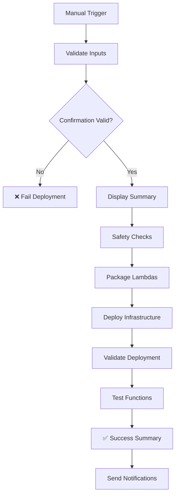

# Manual Production Deployment Guide

**Last Updated:** December 19, 2025
**Status:** Updated for optimized architecture

## Overview

Production deployments are now **manually controlled** and require explicit confirmation to prevent accidental deployments. This guide explains how to safely deploy the optimized AVESA architecture to production using the GitHub Actions workflow.

> **Architecture Update:** This guide covers deployment of the optimized parallel processing architecture.

## Key Changes

### ❌ What's Removed
- **Automatic deployments** on push to main branch
- **No safety confirmations** required
- **Limited audit trail**

### ✅ What's Added
- **Manual trigger only** through GitHub Actions UI
- **Explicit confirmation** required ("DEPLOY TO PRODUCTION")
- **Deployment reason** for audit trail
- **Component selection** (all, infrastructure-only, lambdas-only)
- **Enhanced safety checks** and validation
- **Comprehensive audit logging**
- **Optimized architecture deployment** with performance monitoring
- **Step Functions workflow deployment** for parallel processing

## How to Deploy to Production

### Step 1: Navigate to GitHub Actions
1. Go to your repository on GitHub
2. Click on the **Actions** tab
3. Select **Deploy to Production** workflow
4. Click **Run workflow** button

### Step 2: Fill Required Parameters

#### 🔐 Deployment Confirmation
- **Field:** `deployment_confirmation`
- **Required:** Type exactly `DEPLOY TO PRODUCTION`
- **Purpose:** Prevents accidental deployments

#### 🎯 Environment Target
- **Field:** `environment_target`
- **Required:** Select `production`
- **Purpose:** Confirms target environment

#### 📝 Deployment Reason
- **Field:** `deployment_reason`
- **Required:** Provide clear reason for deployment
- **Examples:**
  - "Deploy new ConnectWise integration features"
  - "Fix critical bug in data transformation"
  - "Update Lambda optimization for pandas layer"

#### 🔧 Components to Deploy
- **Field:** `components_to_deploy`
- **Options:**
  - `all` - Deploy optimized infrastructure, Lambda functions, and Step Functions
  - `infrastructure-only` - Deploy only CDK infrastructure (includes Step Functions state machines)
  - `lambdas-only` - Deploy only optimized Lambda functions
- **Default:** `all`
- **Note:** Uses [`scripts/deploy.sh`](../scripts/deploy.sh) and [`infrastructure/app.py`](../infrastructure/app.py)

#### ⚡ Force Deploy
- **Field:** `force_deploy`
- **Optional:** Check if you want to force deployment
- **Default:** `false`

### Step 3: Review and Execute
1. **Double-check all parameters**
2. **Verify deployment reason is clear**
3. **Click "Run workflow"**
4. **Monitor the deployment progress**

## Deployment Process Flow



## Safety Features

### 🔒 Pre-Deployment Validation
- Confirms exact deployment confirmation text
- Validates environment target
- Requires deployment reason
- Verifies AWS account identity

### 📊 Deployment Summary
- Shows all deployment parameters
- Displays AWS account and region
- Includes timestamp and commit hash
- Provides audit trail

### 🔍 Post-Deployment Validation
- Lists deployed optimized Lambda functions (orchestrator, processors)
- Checks DynamoDB table status (including ProcessingJobs and ChunkProgress tables)
- Verifies S3 bucket access
- Tests Step Functions state machine execution
- Validates CloudWatch dashboard creation
- Tests Lambda function execution and monitoring

## Audit Trail

Every deployment creates a comprehensive audit trail including:

- **Who:** GitHub actor who triggered deployment
- **When:** UTC timestamp of deployment
- **Why:** Deployment reason provided
- **What:** Components deployed
- **Where:** AWS account and region
- **How:** Commit hash and workflow details

## Troubleshooting

### Common Issues

#### ❌ "Invalid deployment confirmation"
- **Cause:** Confirmation text doesn't match exactly
- **Solution:** Type exactly `DEPLOY TO PRODUCTION`

#### ❌ "Deployment reason is required"
- **Cause:** Empty or missing deployment reason
- **Solution:** Provide a clear, descriptive reason

#### ❌ "Lambda packages directory not created"
- **Cause:** Optimized Lambda packaging script failed
- **Solution:** Check [`scripts/package-lightweight-lambdas.py`](../scripts/package-lightweight-lambdas.py) logs and fix any dependency issues

#### ❌ "Deployment failed"
- **Cause:** CDK deployment error with optimized infrastructure
- **Solution:** Check AWS credentials and [`infrastructure/app.py`](../infrastructure/app.py) configuration

### Getting Help

1. **Check workflow logs** in GitHub Actions
2. **Review AWS CloudFormation** events in AWS Console
3. **Verify AWS credentials** and permissions
4. **Contact DevOps team** for infrastructure issues

## Best Practices

### 🎯 When to Deploy
- **After thorough testing** in development environment
- **During maintenance windows** for critical updates
- **With clear deployment reason** for audit purposes

### 📝 Deployment Reasons
- Be specific and descriptive
- Include ticket/issue numbers if applicable
- Mention impact and urgency level

### 🔧 Component Selection
- Use `all` for complete optimized deployments (recommended)
- Use `infrastructure-only` for CDK-only changes (includes Step Functions)
- Use `lambdas-only` for optimized Lambda function updates only

### 🚨 Emergency Deployments
- Still require manual confirmation
- Use `force_deploy` if necessary
- Document emergency reason clearly
- Follow up with post-deployment review

## Security Considerations

- **No automatic deployments** prevent accidental production changes
- **Explicit confirmation** ensures intentional deployments
- **Audit trail** provides accountability and traceability
- **Environment protection** rules still apply in GitHub
- **AWS IAM permissions** control actual deployment access

## Next Steps After Deployment

1. **Monitor application health** and optimized pipeline metrics via CloudWatch dashboards
2. **Verify all services** are functioning correctly (Step Functions, Lambda functions, DynamoDB tables)
3. **Test optimized pipeline execution** with sample tenant data
4. **Run integration tests** for the parallel processing architecture
5. **Monitor performance improvements** compared to legacy system
6. **Update documentation** if needed
7. **Notify stakeholders** of successful optimized deployment

### Monitoring the Optimized Pipeline

```bash
# Check Step Functions executions
aws stepfunctions list-executions --state-machine-arn "arn:aws:states:REGION:ACCOUNT:stateMachine:PipelineOrchestrator-prod"

# Monitor CloudWatch dashboards
aws cloudwatch get-dashboard --dashboard-name "AVESA-Pipeline-Overview-prod"

# Check processing jobs
aws dynamodb scan --table-name ProcessingJobs-prod --max-items 10
```