# Manual Production Deployment Guide

## Overview

Production deployments are now **manually controlled** and require explicit confirmation to prevent accidental deployments. This guide explains how to safely deploy to production using the GitHub Actions workflow.

## Key Changes

### ❌ What's Removed
- **Automatic deployments** on push to main branch
- **No safety confirmations** required
- **Limited audit trail**

### ✅ What's Added
- **Manual trigger only** through GitHub Actions UI
- **Explicit confirmation** required ("DEPLOY TO PRODUCTION")
- **Deployment reason** for audit trail
- **Component selection** (all, infrastructure-only, lambdas-only)
- **Enhanced safety checks** and validation
- **Comprehensive audit logging**

## How to Deploy to Production

### Step 1: Navigate to GitHub Actions
1. Go to your repository on GitHub
2. Click on the **Actions** tab
3. Select **Deploy to Production** workflow
4. Click **Run workflow** button

### Step 2: Fill Required Parameters

#### 🔐 Deployment Confirmation
- **Field:** `deployment_confirmation`
- **Required:** Type exactly `DEPLOY TO PRODUCTION`
- **Purpose:** Prevents accidental deployments

#### 🎯 Environment Target
- **Field:** `environment_target`
- **Required:** Select `production`
- **Purpose:** Confirms target environment

#### 📝 Deployment Reason
- **Field:** `deployment_reason`
- **Required:** Provide clear reason for deployment
- **Examples:**
  - "Deploy new ConnectWise integration features"
  - "Fix critical bug in data transformation"
  - "Update Lambda optimization for pandas layer"

#### 🔧 Components to Deploy
- **Field:** `components_to_deploy`
- **Options:**
  - `all` - Deploy infrastructure and Lambda functions
  - `infrastructure-only` - Deploy only CDK infrastructure
  - `lambdas-only` - Deploy only Lambda functions
- **Default:** `all`

#### ⚡ Force Deploy
- **Field:** `force_deploy`
- **Optional:** Check if you want to force deployment
- **Default:** `false`

### Step 3: Review and Execute
1. **Double-check all parameters**
2. **Verify deployment reason is clear**
3. **Click "Run workflow"**
4. **Monitor the deployment progress**

## Deployment Process Flow

```mermaid
graph TD
    A[Manual Trigger] --> B[Validate Inputs]
    B --> C{Confirmation Valid?}
    C -->|No| D[❌ Fail Deployment]
    C -->|Yes| E[Display Summary]
    E --> F[Safety Checks]
    F --> G[Package Lambdas]
    G --> H[Deploy Infrastructure]
    H --> I[Validate Deployment]
    I --> J[Test Functions]
    J --> K[✅ Success Summary]
    K --> L[Send Notifications]
```

## Safety Features

### 🔒 Pre-Deployment Validation
- Confirms exact deployment confirmation text
- Validates environment target
- Requires deployment reason
- Verifies AWS account identity

### 📊 Deployment Summary
- Shows all deployment parameters
- Displays AWS account and region
- Includes timestamp and commit hash
- Provides audit trail

### 🔍 Post-Deployment Validation
- Lists deployed Lambda functions
- Checks DynamoDB table status
- Verifies S3 bucket access
- Tests Lambda function execution

## Audit Trail

Every deployment creates a comprehensive audit trail including:

- **Who:** GitHub actor who triggered deployment
- **When:** UTC timestamp of deployment
- **Why:** Deployment reason provided
- **What:** Components deployed
- **Where:** AWS account and region
- **How:** Commit hash and workflow details

## Troubleshooting

### Common Issues

#### ❌ "Invalid deployment confirmation"
- **Cause:** Confirmation text doesn't match exactly
- **Solution:** Type exactly `DEPLOY TO PRODUCTION`

#### ❌ "Deployment reason is required"
- **Cause:** Empty or missing deployment reason
- **Solution:** Provide a clear, descriptive reason

#### ❌ "Lambda packages directory not created"
- **Cause:** Lambda packaging script failed
- **Solution:** Check script logs and fix any dependency issues

#### ❌ "Deployment failed"
- **Cause:** CDK deployment error
- **Solution:** Check AWS credentials and infrastructure configuration

### Getting Help

1. **Check workflow logs** in GitHub Actions
2. **Review AWS CloudFormation** events in AWS Console
3. **Verify AWS credentials** and permissions
4. **Contact DevOps team** for infrastructure issues

## Best Practices

### 🎯 When to Deploy
- **After thorough testing** in development environment
- **During maintenance windows** for critical updates
- **With clear deployment reason** for audit purposes

### 📝 Deployment Reasons
- Be specific and descriptive
- Include ticket/issue numbers if applicable
- Mention impact and urgency level

### 🔧 Component Selection
- Use `all` for complete deployments
- Use `infrastructure-only` for CDK-only changes
- Use `lambdas-only` for code-only updates

### 🚨 Emergency Deployments
- Still require manual confirmation
- Use `force_deploy` if necessary
- Document emergency reason clearly
- Follow up with post-deployment review

## Security Considerations

- **No automatic deployments** prevent accidental production changes
- **Explicit confirmation** ensures intentional deployments
- **Audit trail** provides accountability and traceability
- **Environment protection** rules still apply in GitHub
- **AWS IAM permissions** control actual deployment access

## Next Steps After Deployment

1. **Monitor application health** and metrics
2. **Verify all services** are functioning correctly
3. **Run integration tests** if applicable
4. **Update documentation** if needed
5. **Notify stakeholders** of successful deployment