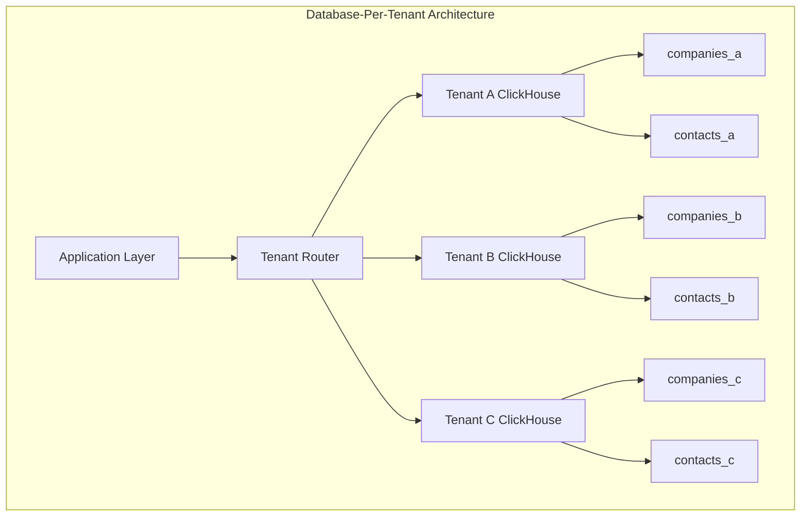
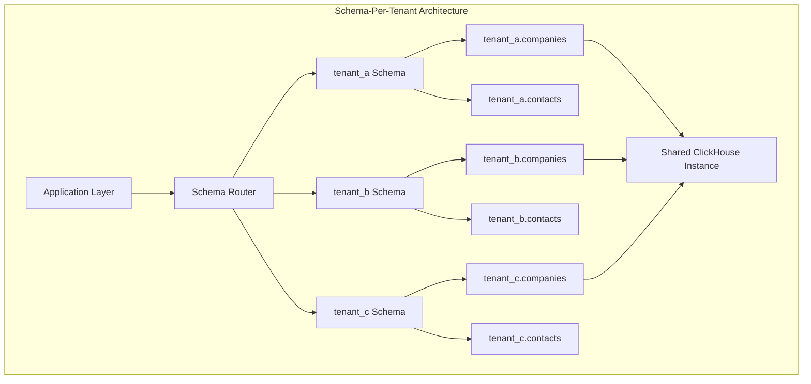
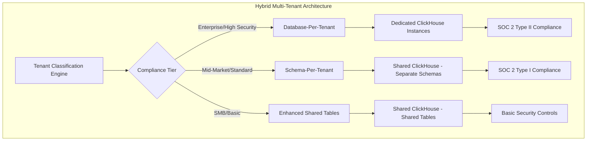
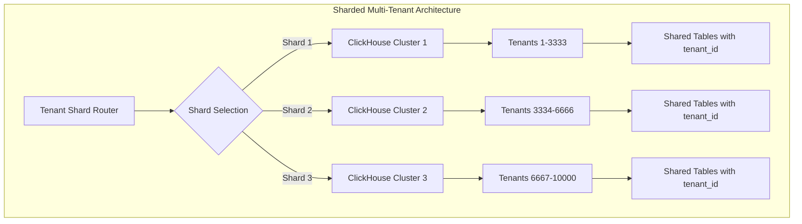

# Multi-Tenant Database Isolation Strategies: Comprehensive Analysis for SOC 2 Compliance

## Executive Summary

This document provides a comprehensive analysis of multi-tenant database isolation strategies for the AVESA SaaS platform, with specific focus on SOC 2 Type II compliance requirements for MSP clients. The analysis evaluates the current shared tables approach, identifies critical compliance gaps, and provides detailed recommendations for alternative isolation strategies that meet enterprise security and regulatory requirements.

**Key Findings:**
- Current shared tables approach presents significant SOC 2 compliance risks
- Application-level isolation creates single points of failure for tenant data segregation
- Alternative strategies provide stronger isolation guarantees but with increased complexity and cost
- Hybrid approach recommended for balancing compliance, performance, and operational efficiency

## Table of Contents

1. [Current Architecture Assessment](#1-current-architecture-assessment)
2. [Shared Tables Approach - Critical Drawbacks](#2-shared-tables-approach---critical-drawbacks)
3. [Alternative Multi-Tenant Strategies](#3-alternative-multi-tenant-strategies)
4. [Detailed Comparison Matrix](#4-detailed-comparison-matrix)
5. [Real-World Scenarios and Risk Assessment](#5-real-world-scenarios-and-risk-assessment)
6. [ClickHouse-Specific Considerations](#6-clickhouse-specific-considerations)
7. [SOC 2 Compliance Analysis](#7-soc-2-compliance-analysis)
8. [Implementation Recommendations](#8-implementation-recommendations)
9. [Migration Strategy](#9-migration-strategy)
10. [Cost-Benefit Analysis](#10-cost-benefit-analysis)

---

## 1. Current Architecture Assessment

### 1.1 Existing Multi-Tenant Implementation

The current AVESA architecture implements multi-tenancy using shared tables with [`tenant_id`](docs/SAAS_ARCHITECTURE_REVIEW.md:184) partitioning in ClickHouse:

```sql
-- Current Implementation
CREATE TABLE companies (
    tenant_id String,
    company_id String,
    company_name String,
    -- Business fields
    status String,
    annual_revenue Nullable(Decimal64(2)),
    
    -- SCD Type 2 fields
    effective_start_date DateTime64(3),
    effective_end_date Nullable(DateTime64(3)),
    is_current Bool,
    record_hash String
) ENGINE = MergeTree()
PARTITION BY (tenant_id, toYYYYMM(partition_date))
ORDER BY (tenant_id, company_id, effective_start_date);
```

### 1.2 Current Isolation Mechanisms

**Storage Level:**
- ClickHouse partitioning by [`tenant_id`](docs/SAAS_ARCHITECTURE_REVIEW.md:932) provides physical data separation
- Monthly partitions enable efficient data lifecycle management
- Partition pruning optimizes query performance

**Application Level:**
- All queries require [`WHERE tenant_id = ?`](docs/SAAS_ARCHITECTURE_REVIEW.md:947) filters
- Backend validation of tenant context before query execution
- Audit logging for compliance tracking

**Database Level:**
- Row-level security policies (limited ClickHouse support)
- Connection pooling with tenant context
- Query result filtering and validation

### 1.3 Scale Characteristics

**Current Metrics:**
- 10,000 tenants with 1-10M records each
- Total data volume: 10-100 billion records
- Query concurrency: 1000+ simultaneous analytical queries
- Data freshness: 15-30 minutes from source to ClickHouse

---

## 2. Shared Tables Approach - Critical Drawbacks

### 2.1 Security Risks and Data Leakage Scenarios

#### **2.1.1 Application-Level Vulnerability Points**

**Query Filter Bypass Risks:**
```javascript
// VULNERABLE: Missing tenant filter
const query = `
    SELECT * FROM companies 
    WHERE company_name LIKE '%${searchTerm}%'
`;
// Result: Exposes data across ALL tenants

// SECURE: Proper tenant isolation
const query = `
    SELECT * FROM companies 
    WHERE tenant_id = '${tenantId}' 
    AND company_name LIKE '%${searchTerm}%'
`;
```

**SQL Injection Attack Vectors:**
```javascript
// VULNERABLE: Improper parameter handling
const maliciousInput = "'; DROP TABLE companies; --";
const query = `SELECT * FROM companies WHERE tenant_id = '${maliciousInput}'`;

// ATTACK RESULT: Could bypass tenant filters or cause data loss
```

**ORM/Query Builder Failures:**
```javascript
// VULNERABLE: ORM misconfiguration
const companies = await Company.findAll({
    where: {
        // Missing tenant_id filter due to developer error
        status: 'Active'
    }
});
// Result: Returns active companies from ALL tenants
```

#### **2.1.2 Database Administrator Risks**

**Accidental Cross-Tenant Queries:**
```sql
-- DANGEROUS: Admin query without tenant filter
SELECT COUNT(*) FROM companies WHERE status = 'Active';
-- Result: Aggregates data across all tenants

-- DANGEROUS: Bulk operations
UPDATE companies SET status = 'Inactive' WHERE last_updated < '2024-01-01';
-- Result: Affects ALL tenants without proper filtering
```

**Backup and Restore Complications:**
- Point-in-time recovery affects all tenants simultaneously
- Selective tenant data restoration requires complex filtering
- Cross-tenant data contamination during restore operations

### 2.2 Performance Degradation with Scale

#### **2.2.1 Query Performance Impact**

**Large Dataset Scanning:**
```sql
-- PERFORMANCE ISSUE: Large table scans
SELECT * FROM companies 
WHERE tenant_id = 'small_tenant_123' 
AND created_date > '2024-01-01';

-- Problem: Must scan through 10B+ records to find 1000 relevant records
-- Impact: Query time increases linearly with total data volume
```

**Index Bloat and Maintenance:**
- Shared indexes become massive with 10,000+ tenants
- Index maintenance operations affect all tenants
- Query plan optimization becomes complex with mixed workloads

**Resource Contention:**
```sql
-- RESOURCE CONTENTION: Large tenant impacts small tenants
-- Large Tenant Query (1M records)
SELECT company_id, SUM(annual_revenue) 
FROM companies 
WHERE tenant_id = 'enterprise_client_001'
GROUP BY company_id;

-- Small Tenant Query (100 records) - BLOCKED
SELECT * FROM companies 
WHERE tenant_id = 'small_client_999' 
AND status = 'Active';
```

#### **2.2.2 Scalability Bottlenecks**

**Memory Pressure:**
- ClickHouse memory usage scales with largest tenant
- Query memory allocation cannot be tenant-specific
- Out-of-memory errors affect all tenants

**I/O Contention:**
- Disk I/O patterns optimized for largest tenants
- Small tenant queries suffer from suboptimal access patterns
- Backup operations impact all tenant performance

### 2.3 Compliance and Regulatory Challenges

#### **2.3.1 SOC 2 Control Failures**

**CC6.1 - Logical and Physical Access Controls:**
- ❌ **FAILURE**: Shared storage violates logical separation requirements
- ❌ **FAILURE**: Single database credentials provide access to all tenant data
- ❌ **FAILURE**: No tenant-specific access control mechanisms

**CC6.3 - Authorization:**
- ❌ **FAILURE**: Application-level authorization creates single point of failure
- ❌ **FAILURE**: Database administrators have unrestricted cross-tenant access
- ❌ **FAILURE**: No separation of duties between tenant data management

**CC7.4 - Data Classification and Handling:**
- ❌ **FAILURE**: Mixed data classification levels in shared storage
- ❌ **FAILURE**: Cannot implement tenant-specific data retention policies
- ❌ **FAILURE**: Audit trails commingled across tenant boundaries

#### **2.3.2 Audit and Compliance Complexity**

**Evidence Collection Challenges:**
```sql
-- AUDIT CHALLENGE: Proving tenant isolation
-- Auditor Question: "Show me that Tenant A cannot access Tenant B data"
-- Current Answer: "Trust our application code" (INSUFFICIENT)

-- Required Evidence: Database-level access controls
-- Current Reality: Application-dependent isolation only
```

**Incident Response Complications:**
- Data breach affects multiple tenants simultaneously
- Forensic analysis complicated by shared storage
- Notification requirements unclear for shared infrastructure

### 2.4 Operational Complexity and Maintenance Issues

#### **2.4.1 Schema Evolution Challenges**

**Tenant-Specific Requirements:**
```sql
-- PROBLEM: Tenant A needs additional field
ALTER TABLE companies ADD COLUMN custom_field_a String;
-- IMPACT: Affects ALL tenants, not just Tenant A

-- PROBLEM: Tenant B has different data retention requirements
-- CURRENT: Cannot implement tenant-specific TTL policies
-- REQUIRED: Separate retention policies per tenant
```

**Version Management:**
- Schema changes affect all tenants simultaneously
- Cannot test changes on subset of tenants
- Rollback operations impact entire platform

#### **2.4.2 Backup and Recovery Complications**

**Granular Recovery Challenges:**
```bash
# PROBLEM: Tenant-specific data recovery
# Current: Must restore entire database to recover single tenant
# Required: Tenant-specific backup and restore capabilities

# PROBLEM: Point-in-time recovery
# Current: All tenants must be restored to same point in time
# Required: Independent recovery timelines per tenant
```

**Data Lifecycle Management:**
- Cannot implement tenant-specific archival policies
- Data purging affects all tenants or none
- Compliance-driven data deletion becomes complex

---

## 3. Alternative Multi-Tenant Strategies

### 3.1 Database-Per-Tenant (Complete Isolation)

#### **3.1.1 Architecture Overview**



#### **3.1.2 Implementation Details**

**ClickHouse Cloud Configuration:**
```yaml
# Tenant-specific ClickHouse instances
tenant_databases:
  tenant_001:
    instance: "avesa-tenant-001.clickhouse.cloud"
    database: "tenant_001_analytics"
    credentials: "tenant-001-credentials"
    
  tenant_002:
    instance: "avesa-tenant-002.clickhouse.cloud"
    database: "tenant_002_analytics"
    credentials: "tenant-002-credentials"
```

**Application Routing Logic:**
```javascript
class TenantDatabaseRouter {
    constructor() {
        this.tenantConnections = new Map();
    }
    
    async getConnection(tenantId) {
        if (!this.tenantConnections.has(tenantId)) {
            const config = await this.getTenantConfig(tenantId);
            const connection = new ClickHouseClient(config);
            this.tenantConnections.set(tenantId, connection);
        }
        return this.tenantConnections.get(tenantId);
    }
    
    async query(tenantId, sql, params) {
        const connection = await this.getConnection(tenantId);
        // No need for tenant_id filters - complete isolation
        return await connection.query(sql, params);
    }
}
```

#### **3.1.3 Advantages**

**Security Benefits:**
- ✅ **Complete Data Isolation**: Physical separation at database level
- ✅ **Credential Separation**: Unique credentials per tenant
- ✅ **Network Isolation**: Separate VPC/security groups possible
- ✅ **Audit Simplicity**: Clear tenant boundaries for compliance

**Operational Benefits:**
- ✅ **Independent Schema Evolution**: Tenant-specific schema changes
- ✅ **Granular Backup/Restore**: Tenant-specific recovery operations
- ✅ **Performance Isolation**: No cross-tenant resource contention
- ✅ **Compliance Alignment**: Meets strictest isolation requirements

**Scalability Benefits:**
- ✅ **Resource Allocation**: Tenant-specific resource sizing
- ✅ **Geographic Distribution**: Tenant-specific data residency
- ✅ **Independent Scaling**: Scale individual tenants as needed

#### **3.1.4 Disadvantages**

**Cost Implications:**
- ❌ **High Infrastructure Costs**: 10,000 separate ClickHouse instances
- ❌ **Management Overhead**: Complex multi-instance operations
- ❌ **Resource Inefficiency**: Underutilized small tenant instances

**Operational Complexity:**
- ❌ **Connection Management**: 10,000+ database connections
- ❌ **Monitoring Complexity**: Instance-specific monitoring required
- ❌ **Deployment Complexity**: Multi-instance deployment pipelines

**Analytics Limitations:**
- ❌ **Cross-Tenant Analytics**: Platform-wide insights become impossible
- ❌ **Aggregation Complexity**: Multi-database queries required
- ❌ **Reporting Challenges**: Complex cross-tenant reporting

### 3.2 Schema-Per-Tenant (Moderate Isolation)

#### **3.2.1 Architecture Overview**



#### **3.2.2 Implementation Details**

**Schema Creation Strategy:**
```sql
-- Create tenant-specific schemas
CREATE DATABASE tenant_001;
CREATE DATABASE tenant_002;
CREATE DATABASE tenant_003;

-- Tenant-specific tables
CREATE TABLE tenant_001.companies (
    company_id String,
    company_name String,
    -- No tenant_id needed - schema provides isolation
    effective_start_date DateTime64(3),
    effective_end_date Nullable(DateTime64(3)),
    is_current Bool
) ENGINE = MergeTree()
ORDER BY (company_id, effective_start_date);

CREATE TABLE tenant_002.companies (
    -- Identical structure but separate namespace
    company_id String,
    company_name String,
    effective_start_date DateTime64(3),
    effective_end_date Nullable(DateTime64(3)),
    is_current Bool
) ENGINE = MergeTree()
ORDER BY (company_id, effective_start_date);
```

**Application Query Patterns:**
```javascript
class SchemaPerTenantClient {
    async query(tenantId, tableName, sql, params) {
        // Automatically prefix with tenant schema
        const schemaQualifiedSql = sql.replace(
            new RegExp(`\\b${tableName}\\b`, 'g'),
            `tenant_${tenantId}.${tableName}`
        );
        
        return await this.clickhouse.query(schemaQualifiedSql, params);
    }
    
    async getCompanies(tenantId, filters) {
        const sql = `
            SELECT * FROM companies 
            WHERE status = ? AND is_current = 1
        `;
        // Becomes: SELECT * FROM tenant_001.companies WHERE...
        return await this.query(tenantId, 'companies', sql, [filters.status]);
    }
}
```

#### **3.2.3 Advantages**

**Security Benefits:**
- ✅ **Database-Level Isolation**: Schema boundaries enforced by ClickHouse
- ✅ **Simplified Access Control**: Schema-level permissions
- ✅ **Reduced Application Complexity**: No tenant_id filtering required
- ✅ **Audit Trail Clarity**: Schema-specific audit logs

**Operational Benefits:**
- ✅ **Shared Infrastructure**: Single ClickHouse instance
- ✅ **Independent Schema Evolution**: Tenant-specific schema changes
- ✅ **Granular Backup**: Schema-level backup and restore
- ✅ **Resource Sharing**: Efficient resource utilization

**Performance Benefits:**
- ✅ **Query Optimization**: Schema-specific query plans
- ✅ **Index Efficiency**: Smaller, tenant-specific indexes
- ✅ **Reduced Data Scanning**: No cross-tenant data access

#### **3.2.4 Disadvantages**

**Scalability Concerns:**
- ❌ **Schema Proliferation**: 10,000 schemas in single instance
- ❌ **Metadata Overhead**: Large system catalog with many schemas
- ❌ **Connection Complexity**: Schema-specific connection management

**Operational Challenges:**
- ❌ **Schema Management**: Complex schema lifecycle operations
- ❌ **Cross-Tenant Queries**: Difficult platform-wide analytics
- ❌ **Resource Contention**: Shared instance resource competition

**ClickHouse Limitations:**
- ❌ **Limited Schema Support**: ClickHouse schema features less mature
- ❌ **Performance Impact**: Metadata overhead with many schemas
- ❌ **Backup Complexity**: Schema-level backup coordination

### 3.3 Hybrid Approach (Tiered Isolation)

#### **3.3.1 Architecture Overview**



#### **3.3.2 Tenant Classification Strategy**

**Classification Criteria:**
```yaml
tenant_classification:
  enterprise:
    criteria:
      - annual_revenue: "> $10M"
      - user_count: "> 1000"
      - compliance_requirements: ["SOC2_TYPE_II", "HIPAA", "GDPR"]
      - data_sensitivity: "HIGH"
    isolation_strategy: "database_per_tenant"
    
  mid_market:
    criteria:
      - annual_revenue: "$1M - $10M"
      - user_count: "100 - 1000"
      - compliance_requirements: ["SOC2_TYPE_I"]
      - data_sensitivity: "MEDIUM"
    isolation_strategy: "schema_per_tenant"
    
  small_business:
    criteria:
      - annual_revenue: "< $1M"
      - user_count: "< 100"
      - compliance_requirements: ["BASIC"]
      - data_sensitivity: "LOW"
    isolation_strategy: "enhanced_shared_tables"
```

**Dynamic Tenant Migration:**
```javascript
class TenantMigrationManager {
    async evaluateTenantTier(tenantId) {
        const tenant = await this.getTenantMetrics(tenantId);
        const currentTier = tenant.isolation_tier;
        const recommendedTier = this.calculateRecommendedTier(tenant);
        
        if (currentTier !== recommendedTier) {
            await this.scheduleTenantMigration(tenantId, currentTier, recommendedTier);
        }
    }
    
    async migrateTenant(tenantId, fromTier, toTier) {
        const migrationPlan = this.createMigrationPlan(fromTier, toTier);
        
        // Example: Shared Tables → Schema-Per-Tenant
        if (fromTier === 'shared' && toTier === 'schema') {
            await this.createTenantSchema(tenantId);
            await this.migrateData(tenantId, 'shared_tables', 'tenant_schema');
            await this.updateApplicationRouting(tenantId, 'schema');
            await this.validateMigration(tenantId);
        }
    }
}
```

#### **3.3.3 Advantages**

**Cost Optimization:**
- ✅ **Tiered Pricing**: Match isolation costs to tenant value
- ✅ **Resource Efficiency**: Optimal resource allocation per tier
- ✅ **Scalable Economics**: Cost scales with tenant requirements

**Compliance Flexibility:**
- ✅ **Targeted Compliance**: Meet specific regulatory requirements
- ✅ **Audit Efficiency**: Focus compliance efforts on high-risk tenants
- ✅ **Risk Management**: Appropriate controls for risk levels

**Operational Benefits:**
- ✅ **Gradual Migration**: Phased implementation approach
- ✅ **Tenant Growth Path**: Clear upgrade path for growing tenants
- ✅ **Simplified Management**: Tier-specific operational procedures

#### **3.3.4 Implementation Complexity**

**Multi-Tier Management:**
- ❌ **Complex Routing Logic**: Tier-aware application architecture
- ❌ **Migration Overhead**: Tenant tier transition management
- ❌ **Monitoring Complexity**: Tier-specific monitoring and alerting

### 3.4 Sharded Approach (Horizontal Distribution)

#### **3.4.1 Architecture Overview**



#### **3.4.2 Sharding Strategy**

**Tenant Distribution Logic:**
```javascript
class TenantShardRouter {
    constructor() {
        this.shardCount = 3;
        this.shardConnections = new Map();
    }
    
    getShardForTenant(tenantId) {
        // Consistent hashing for tenant distribution
        const hash = this.hashTenantId(tenantId);
        return hash % this.shardCount;
    }
    
    async query(tenantId, sql, params) {
        const shardId = this.getShardForTenant(tenantId);
        const connection = this.getShardConnection(shardId);
        
        // Still need tenant_id filtering within shard
        const tenantSafeSql = this.addTenantFilter(sql, tenantId);
        return await connection.query(tenantSafeSql, params);
    }
    
    async crossShardQuery(sql, params) {
        // For platform-wide analytics
        const promises = [];
        for (let shardId = 0; shardId < this.shardCount; shardId++) {
            const connection = this.getShardConnection(shardId);
            promises.push(connection.query(sql, params));
        }
        
        const results = await Promise.all(promises);
        return this.aggregateResults(results);
    }
}
```

#### **3.4.3 Advantages**

**Scalability Benefits:**
- ✅ **Horizontal Scaling**: Distribute load across multiple instances
- ✅ **Performance Isolation**: Tenant groups isolated by shard
- ✅ **Resource Distribution**: Balanced resource utilization

**Operational Benefits:**
- ✅ **Partial Failure Isolation**: Shard failures don't affect all tenants
- ✅ **Maintenance Windows**: Rolling maintenance across shards
- ✅ **Capacity Planning**: Shard-specific capacity management

#### **3.4.4 Disadvantages**

**Complexity Overhead:**
- ❌ **Routing Complexity**: Complex tenant-to-shard mapping
- ❌ **Cross-Shard Queries**: Difficult platform-wide analytics
- ❌ **Rebalancing Challenges**: Tenant redistribution complexity

**Limited Isolation:**
- ❌ **Shared Table Issues**: Still requires tenant_id filtering
- ❌ **Compliance Gaps**: Same SOC 2 issues as shared tables
- ❌ **Security Risks**: Application-level isolation dependency

---

## 4. Detailed Comparison Matrix

### 4.1 Security Isolation Assessment

| Security Factor | Shared Tables | Schema-Per-Tenant | Database-Per-Tenant | Hybrid Approach |
|-----------------|---------------|-------------------|---------------------|-----------------|
| **Data Isolation Level** | Application | Database Schema | Database Instance | Tiered |
| **Access Control** | Application-enforced | Schema-level | Instance-level | Tier-appropriate |
| **Credential Separation** | ❌ Shared | ⚠️ Limited | ✅ Complete | ✅ Tiered |
| **Network Isolation** | ❌ None | ❌ None | ✅ Possible | ⚠️ Partial |
| **Query Injection Risk** | ❌ High | ⚠️ Medium | ✅ Low | ⚠️ Varies |
| **Admin Access Risk** | ❌ High | ⚠️ Medium | ✅ Low | ⚠️ Varies |
| **Audit Trail Clarity** | ❌ Complex | ⚠️ Moderate | ✅ Clear | ⚠️ Varies |

### 4.2 Performance Characteristics

| Performance Factor | Shared Tables | Schema-Per-Tenant | Database-Per-Tenant | Hybrid Approach |
|--------------------|---------------|-------------------|---------------------|-----------------|
| **Query Performance** | ⚠️ Degrades with scale | ✅ Good | ✅ Excellent | ⚠️ Varies |
| **Resource Contention** | ❌ High | ⚠️ Medium | ✅ None | ⚠️ Varies |
| **Index Efficiency** | ❌ Large shared indexes | ✅ Tenant-specific | ✅ Optimal | ⚠️ Mixed |
| **Memory Usage** | ❌ Shared pools | ⚠️ Shared instance | ✅ Dedicated | ⚠️ Mixed |
| **I/O Patterns** | ❌ Mixed workloads | ⚠️ Shared I/O | ✅ Isolated | ⚠️ Mixed |
| **Scalability Limit** | ❌ Single instance | ⚠️ Schema limits | ✅ Unlimited | ✅ Flexible |

### 4.3 Operational Complexity

| Operational Factor | Shared Tables | Schema-Per-Tenant | Database-Per-Tenant | Hybrid Approach |
|--------------------|---------------|-------------------|---------------------|-----------------|
| **Initial Setup** | ✅ Simple | ⚠️ Moderate | ❌ Complex | ❌ Very Complex |
| **Schema Evolution** | ❌ All-or-nothing | ✅ Tenant-specific | ✅ Independent | ⚠️ Tier-specific |
| **Backup/Restore** | ❌ All tenants | ✅ Schema-level | ✅ Tenant-specific | ⚠️ Mixed |
| **Monitoring** | ✅ Single system | ⚠️ Schema-aware | ❌ Multi-instance | ❌ Multi-tier |
| **Deployment** | ✅ Simple | ⚠️ Schema coordination | ❌ Multi-instance | ❌ Complex |
| **Troubleshooting** | ❌ Cross-tenant impact | ⚠️ Schema isolation | ✅ Isolated | ⚠️ Tier-dependent |

### 4.4 Cost Implications (10,000 tenants)

| Cost Factor | Shared Tables | Schema-Per-Tenant | Database-Per-Tenant | Hybrid Approach |
|-------------|---------------|-------------------|---------------------|-----------------|
| **Infrastructure** | $2,500/month | $8,000/month | $50,000/month | $15,000/month |
| **Operational** | $1,000/month | $3,000/month | $10,000/month | $4,000/month |
| **Development** | $5,000 initial | $15,000 initial | $30,000 initial | $25,000 initial |
| **Maintenance** | $2,000/month | $4,000/month | $8,000/month | $5,000/month |
| **Total Monthly** | $5,500 | $15,000 | $68,000 | $24,000 |

### 4.5 Compliance Considerations

| Compliance Factor | Shared Tables | Schema-Per-Tenant | Database-Per-Tenant | Hybrid Approach |
|-------------------|---------------|-------------------|---------------------|-----------------|
| **SOC 2 CC6.1** | ❌ Fails | ⚠️ Partial | ✅ Passes | ✅ Tier-appropriate |
| **SOC 2 CC6.3** | ❌ Fails | ⚠️ Partial | ✅ Passes | ✅ Tier-appropriate |
| **SOC 2 CC7.4** | ❌ Fails | ⚠️ Partial | ✅ Passes | ✅ Tier-appropriate |
| **Data Residency** | ❌ Complex | ❌ Complex | ✅ Simple | ⚠️ Tier-dependent |
| **Right to be Forgotten** | ❌ Complex | ⚠️ Moderate | ✅ Simple | ⚠️ Tier-dependent |
| **Audit Evidence** | ❌ Insufficient | ⚠️ Moderate | ✅ Strong | ✅ Tier-appropriate |

---

## 5. Real-World Scenarios and Risk Assessment

### 5.1 Data Breach Scenarios

#### **5.1.1 Scenario: SQL Injection Attack**

**Shared Tables Impact:**
```javascript
// ATTACK: Malicious input bypasses tenant filter
const maliciousQuery = "'; UNION SELECT * FROM companies WHERE '1'='1"; 
const sql = `SELECT * FROM companies WHERE tenant_id = '${tenantId}' AND name LIKE '%${maliciousQuery}%'`;

// RESULT: Exposes ALL tenant data
// BLAST RADIUS: 10,000 tenants affected
// NOTIFICATION REQUIREMENT: All tenants must be notified
// RECOVERY TIME: Platform-wide incident response
```

**Database-Per-Tenant Impact:**
```javascript
// ATTACK: Same malicious input
const maliciousQuery = "'; UNION SELECT * FROM companies WHERE '1'='1";
const sql = `SELECT * FROM companies WHERE name LIKE '%${maliciousQuery}%'`;

// RESULT: Exposes only single tenant data
// BLAST RADIUS: 1 tenant affected
// NOTIFICATION REQUIREMENT: Single tenant notification
// RECOVERY TIME: Isolated incident response
```

#### **5.1.2 Scenario: Application Bug Removes Tenant Filter**

**Code Deployment Error:**
```javascript
// BUGGY CODE: Missing tenant filter due to refactoring error
class CompanyService {
    async getActiveCompanies(tenantId) {
        // BUG: Developer forgot to add tenant filter
        return await db.query(`
            SELECT * FROM companies 
            WHERE status =