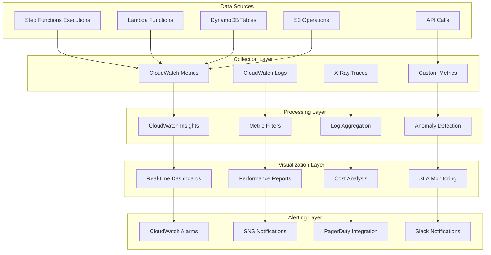

# AVESA Performance Monitoring Strategy

## Overview

This document outlines the comprehensive monitoring strategy for the optimized AVESA data pipeline. The strategy provides real-time visibility into system performance, proactive alerting, and data-driven optimization opportunities.

## Monitoring Architecture



## Key Performance Indicators (KPIs)

### 1. Throughput Metrics

#### Records Processing Rate
```python
# CloudWatch Metric Definition
{
    "MetricName": "RecordsProcessedPerMinute",
    "Namespace": "AVESA/DataPipeline",
    "Dimensions": [
        {"Name": "TenantId", "Value": "${tenant_id}"},
        {"Name": "TableName", "Value": "${table_name}"},
        {"Name": "Environment", "Value": "${environment}"}
    ],
    "Unit": "Count/Minute",
    "Value": "${records_processed}",
    "Timestamp": "${timestamp}"
}
```

**Target**: 10,000+ records per minute per tenant
**Alert Threshold**: < 5,000 records per minute for 10 minutes

#### API Call Efficiency
```python
{
    "MetricName": "APICallsPerRecord",
    "Namespace": "AVESA/DataPipeline",
    "Unit": "Count",
    "Value": "${api_calls} / ${records_processed}",
    "Target": "< 0.001 calls per record"
}
```

### 2. Performance Metrics

#### Execution Time Distribution
```python
class ExecutionTimeTracker:
    def track_execution_time(self, operation: str, execution_time: float, 
                           tenant_id: str, table_name: str):
        # Send detailed timing metrics
        cloudwatch.put_metric_data(
            Namespace='AVESA/Performance',
            MetricData=[
                {
                    'MetricName': f'{operation}ExecutionTime',
                    'Dimensions': [
                        {'Name': 'TenantId', 'Value': tenant_id},
                        {'Name': 'TableName', 'Value': table_name},
                        {'Name': 'Operation', 'Value': operation}
                    ],
                    'Value': execution_time,
                    'Unit': 'Seconds'
                },
                {
                    'MetricName': f'{operation}ExecutionTimeP95',
                    'Value': execution_time,
                    'Unit': 'Seconds',
                    'StatisticValues': {
                        'SampleCount': 1,
                        'Sum': execution_time,
                        'Minimum': execution_time,
                        'Maximum': execution_time
                    }
                }
            ]
        )
```

**Targets**:
- Chunk Processing: < 5 minutes per chunk
- Table Processing: < 30 minutes per table
- Tenant Processing: < 2 hours per tenant
- Pipeline Execution: < 6 hours total

#### Memory and Resource Utilization
```python
{
    "LambdaMemoryUtilization": {
        "target": "< 80%",
        "alert_threshold": "> 90%",
        "critical_threshold": "> 95%"
    },
    "DynamoDBThrottling": {
        "target": "0 throttled requests",
        "alert_threshold": "> 5 throttled requests per hour"
    },
    "S3RequestRate": {
        "target": "< 3500 requests per second",
        "alert_threshold": "> 3000 requests per second"
    }
}
```

### 3. Reliability Metrics

#### Error Rates and Types
```python
class ErrorTracker:
    def __init__(self):
        self.error_categories = {
            'api_errors': ['timeout', 'rate_limit', 'authentication'],
            'processing_errors': ['memory_limit', 'timeout', 'data_validation'],
            'infrastructure_errors': ['lambda_limit', 'dynamodb_throttle', 's3_error']
        }
    
    def track_error(self, error_type: str, error_details: dict, 
                   tenant_id: str, table_name: str):
        category = self.categorize_error(error_type)
        
        cloudwatch.put_metric_data(
            Namespace='AVESA/Reliability',
            MetricData=[
                {
                    'MetricName': 'ErrorRate',
                    'Dimensions': [
                        {'Name': 'ErrorCategory', 'Value': category},
                        {'Name': 'ErrorType', 'Value': error_type},
                        {'Name': 'TenantId', 'Value': tenant_id}
                    ],
                    'Value': 1,
                    'Unit': 'Count'
                },
                {
                    'MetricName': 'TotalErrors',
                    'Value': 1,
                    'Unit': 'Count'
                }
            ]
        )
```

**Targets**:
- Overall Error Rate: < 2%
- API Error Rate: < 1%
- Processing Error Rate: < 0.5%
- Infrastructure Error Rate: < 0.1%

#### Recovery Time Metrics
```python
{
    "MeanTimeToRecovery": {
        "target": "< 5 minutes",
        "measurement": "Time from error detection to successful retry"
    },
    "AutoRecoveryRate": {
        "target": "> 95%",
        "measurement": "Percentage of errors resolved automatically"
    }
}
```

### 4. Business Impact Metrics

#### Data Freshness
```python
class DataFreshnessTracker:
    def calculate_data_freshness(self, tenant_id: str, table_name: str) -> float:
        # Get last successful processing time
        last_processed = self.get_last_processing_time(tenant_id, table_name)
        
        # Calculate freshness in minutes
        freshness_minutes = (datetime.utcnow() - last_processed).total_seconds() / 60
        
        cloudwatch.put_metric_data(
            Namespace='AVESA/BusinessImpact',
            MetricData=[{
                'MetricName': 'DataFreshnessMinutes',
                'Dimensions': [
                    {'Name': 'TenantId', 'Value': tenant_id},
                    {'Name': 'TableName', 'Value': table_name}
                ],
                'Value': freshness_minutes,
                'Unit': 'Count'
            }]
        )
        
        return freshness_minutes
```

**Targets**:
- Critical Tables (tickets, time_entries): < 15 minutes
- Standard Tables (companies, contacts): < 60 minutes
- Reference Tables: < 4 hours

#### SLA Compliance
```python
{
    "ProcessingTimeSLA": {
        "target": "95% of executions complete within SLA",
        "sla_thresholds": {
            "single_tenant": "30 minutes",
            "multi_tenant_10": "2 hours",
            "multi_tenant_100": "6 hours"
        }
    },
    "DataAvailabilitySLA": {
        "target": "99.9% uptime",
        "measurement": "Percentage of time data is available and fresh"
    }
}
```

## Real-Time Dashboards

### 1. Executive Dashboard
**Audience**: Leadership and stakeholders
**Update Frequency**: Real-time (30-second refresh)

```python
class ExecutiveDashboard:
    def create_dashboard(self) -> cloudwatch.Dashboard:
        dashboard = cloudwatch.Dashboard(
            self, "AVESAExecutiveDashboard",
            dashboard_name="AVESA-Executive-Overview"
        )
        
        dashboard.add_widgets(
            # High-level KPIs
            cloudwatch.SingleValueWidget(
                title="Total Records Processed Today",
                metrics=[
                    cloudwatch.Metric(
                        namespace="AVESA/DataPipeline",
                        metric_name="RecordsProcessedPerMinute",
                        statistic="Sum",
                        period=Duration.hours(24)
                    )
                ],
                width=6,
                height=3
            ),
            
            # System Health Score
            cloudwatch.GaugeWidget(
                title="System Health Score",
                metrics=[
                    cloudwatch.MathExpression(
                        expression="100 - (error_rate * 10 + latency_score * 5)",
                        using_metrics={
                            "error_rate": cloudwatch.Metric(
                                namespace="AVESA/Reliability",
                                metric_name="ErrorRate"
                            ),
                            "latency_score": cloudwatch.Metric(
                                namespace="AVESA/Performance",
                                metric_name="LatencyScore"
                            )
                        }
                    )
                ],
                left_y_axis=cloudwatch.YAxisProps(min=0, max=100),
                width=6,
                height=3
            ),
            
            # Processing Trends
            cloudwatch.GraphWidget(
                title="Processing Trends (24h)",
                left=[
                    cloudwatch.Metric(
                        namespace="AVESA/DataPipeline",
                        metric_name="RecordsProcessedPerMinute",
                        statistic="Average"
                    )
                ],
                right=[
                    cloudwatch.Metric(
                        namespace="AVESA/Reliability",
                        metric_name="ErrorRate",
                        statistic="Average"
                    )
                ],
                width=12,
                height=6
            )
        )
        
        return dashboard
```

### 2. Operations Dashboard
**Audience**: DevOps and operations teams
**Update Frequency**: Real-time (10-second refresh)

```python
class OperationsDashboard:
    def create_dashboard(self) -> cloudwatch.Dashboard:
        dashboard = cloudwatch.Dashboard(
            self, "AVESAOperationsDashboard",
            dashboard_name="AVESA-Operations-Detailed"
        )
        
        dashboard.add_widgets(
            # Active Executions
            cloudwatch.GraphWidget(
                title="Active Step Functions Executions",
                left=[
                    cloudwatch.Metric(
                        namespace="AWS/StepFunctions",
                        metric_name="ExecutionsStarted",
                        dimensions_map={"StateMachineArn": self.pipeline_orchestrator_arn}
                    ),
                    cloudwatch.Metric(
                        namespace="AWS/StepFunctions",
                        metric_name="ExecutionsSucceeded",
                        dimensions_map={"StateMachineArn": self.pipeline_orchestrator_arn}
                    ),
                    cloudwatch.Metric(
                        namespace="AWS/StepFunctions",
                        metric_name="ExecutionsFailed",
                        dimensions_map={"StateMachineArn": self.pipeline_orchestrator_arn}
                    )
                ],
                width=12,
                height=6
            ),
            
            # Lambda Performance
            cloudwatch.GraphWidget(
                title="Lambda Function Performance",
                left=[
                    cloudwatch.Metric(
                        namespace="AWS/Lambda",
                        metric_name="Duration",
                        dimensions_map={"FunctionName": "avesa-chunk-processor"}
                    ),
                    cloudwatch.Metric(
                        namespace="AWS/Lambda",
                        metric_name="MemoryUtilization",
                        dimensions_map={"FunctionName": "avesa-chunk-processor"}
                    )
                ],
                right=[
                    cloudwatch.Metric(
                        namespace="AWS/Lambda",
                        metric_name="Errors",
                        dimensions_map={"FunctionName": "avesa-chunk-processor"}
                    ),
                    cloudwatch.Metric(
                        namespace="AWS/Lambda",
                        metric_name="Throttles",
                        dimensions_map={"FunctionName": "avesa-chunk-processor"}
                    )
                ],
                width=12,
                height=6
            ),
            
            # DynamoDB Performance
            cloudwatch.GraphWidget(
                title="DynamoDB Performance",
                left=[
                    cloudwatch.Metric(
                        namespace="AWS/DynamoDB",
                        metric_name="ConsumedReadCapacityUnits",
                        dimensions_map={"TableName": "ProcessingJobs"}
                    ),
                    cloudwatch.Metric(
                        namespace="AWS/DynamoDB",
                        metric_name="ConsumedWriteCapacityUnits",
                        dimensions_map={"TableName": "ProcessingJobs"}
                    )
                ],
                right=[
                    cloudwatch.Metric(
                        namespace="AWS/DynamoDB",
                        metric_name="ThrottledRequests",
                        dimensions_map={"TableName": "ProcessingJobs"}
                    )
                ],
                width=12,
                height=6
            )
        )
        
        return dashboard
```

### 3. Performance Analysis Dashboard
**Audience**: Development and architecture teams
**Update Frequency**: 1-minute refresh

```python
class PerformanceAnalysisDashboard:
    def create_dashboard(self) -> cloudwatch.Dashboard:
        dashboard = cloudwatch.Dashboard(
            self, "AVESAPerformanceDashboard",
            dashboard_name="AVESA-Performance-Analysis"
        )
        
        dashboard.add_widgets(
            # Throughput Analysis
            cloudwatch.GraphWidget(
                title="Throughput by Tenant",
                left=[
                    cloudwatch.Metric(
                        namespace="AVESA/DataPipeline",
                        metric_name="RecordsProcessedPerMinute",
                        dimensions_map={"TenantId": "ALL"},
                        statistic="Average"
                    )
                ],
                width=12,
                height=6,
                view=cloudwatch.GraphWidgetView.BAR
            ),
            
            # API Performance
            cloudwatch.GraphWidget(
                title="API Call Performance",
                left=[
                    cloudwatch.Metric(
                        namespace="AVESA/API",
                        metric_name="ResponseTime",
                        statistic="Average"
                    ),
                    cloudwatch.Metric(
                        namespace="AVESA/API",
                        metric_name="ResponseTime",
                        statistic="p95"
                    )
                ],
                right=[
                    cloudwatch.Metric(
                        namespace="AVESA/API",
                        metric_name="RequestsPerSecond"
                    )
                ],
                width=12,
                height=6
            ),
            
            # Chunk Processing Efficiency
            cloudwatch.GraphWidget(
                title="Chunk Processing Efficiency",
                left=[
                    cloudwatch.Metric(
                        namespace="AVESA/Performance",
                        metric_name="ChunkProcessingTime",
                        statistic="Average"
                    ),
                    cloudwatch.Metric(
                        namespace="AVESA/Performance",
                        metric_name="RecordsPerChunk",
                        statistic="Average"
                    )
                ],
                width=12,
                height=6
            )
        )
        
        return dashboard
```

## Alerting Strategy

### 1. Critical Alerts (Immediate Response)
**Response Time**: < 5 minutes
**Escalation**: PagerDuty → On-call engineer

```python
class CriticalAlerts:
    def create_critical_alerts(self):
        # System Down Alert
        cloudwatch.Alarm(
            self, "SystemDownAlert",
            alarm_name="AVESA-CRITICAL-SystemDown",
            metric=cloudwatch.Metric(
                namespace="AVESA/Reliability",
                metric_name="SystemAvailability"
            ),
            threshold=95,  # Below 95% availability
            comparison_operator=cloudwatch.ComparisonOperator.LESS_THAN_THRESHOLD,
            evaluation_periods=2,
            period=Duration.minutes(1),
            alarm_actions=[
                sns.Topic.from_topic_arn(self, "PagerDutyTopic", self.pagerduty_topic_arn)
            ]
        )
        
        # Data Loss Alert
        cloudwatch.Alarm(
            self, "DataLossAlert",
            alarm_name="AVESA-CRITICAL-DataLoss",
            metric=cloudwatch.Metric(
                namespace="AVESA/DataIntegrity",
                metric_name="RecordLossDetected"
            ),
            threshold=1,  # Any data loss
            comparison_operator=cloudwatch.ComparisonOperator.GREATER_THAN_OR_EQUAL_TO_THRESHOLD,
            evaluation_periods=1,
            period=Duration.minutes(1)
        )
        
        # High Error Rate Alert
        cloudwatch.Alarm(
            self, "HighErrorRateAlert",
            alarm_name="AVESA-CRITICAL-HighErrorRate",
            metric=cloudwatch.Metric(
                namespace="AVESA/Reliability",
                metric_name="ErrorRate"
            ),
            threshold=20,  # 20% error rate
            comparison_operator=cloudwatch.ComparisonOperator.GREATER_THAN_THRESHOLD,
            evaluation_periods=3,
            period=Duration.minutes(5)
        )
```

### 2. Warning Alerts (Proactive Monitoring)
**Response Time**: < 30 minutes
**Escalation**: Slack → Team channel

```python
class WarningAlerts:
    def create_warning_alerts(self):
        # Performance Degradation
        cloudwatch.Alarm(
            self, "PerformanceDegradation",
            alarm_name="AVESA-WARNING-PerformanceDegradation",
            metric=cloudwatch.Metric(
                namespace="AVESA/Performance",
                metric_name="ProcessingTime"
            ),
            threshold=1800,  # 30 minutes
            comparison_operator=cloudwatch.ComparisonOperator.GREATER_THAN_THRESHOLD,
            evaluation_periods=2,
            period=Duration.minutes(10)
        )
        
        # Resource Utilization
        cloudwatch.Alarm(
            self, "HighResourceUtilization",
            alarm_name="AVESA-WARNING-HighResourceUtilization",
            metric=cloudwatch.Metric(
                namespace="AWS/Lambda",
                metric_name="MemoryUtilization"
            ),
            threshold=85,  # 85% memory usage
            comparison_operator=cloudwatch.ComparisonOperator.GREATER_THAN_THRESHOLD,
            evaluation_periods=3,
            period=Duration.minutes(5)
        )
        
        # Cost Anomaly
        cloudwatch.Alarm(
            self, "CostAnomaly",
            alarm_name="AVESA-WARNING-CostAnomaly",
            metric=cloudwatch.Metric(
                namespace="AVESA/Cost",
                metric_name="HourlyCost"
            ),
            threshold=100,  # $100/hour
            comparison_operator=cloudwatch.ComparisonOperator.GREATER_THAN_THRESHOLD,
            evaluation_periods=2,
            period=Duration.hours(1)
        )
```

### 3. Informational Alerts (Trend Monitoring)
**Response Time**: Next business day
**Escalation**: Email → Team distribution list

```python
class InformationalAlerts:
    def create_informational_alerts(self):
        # Capacity Planning
        cloudwatch.Alarm(
            self, "CapacityPlanningAlert",
            alarm_name="AVESA-INFO-CapacityPlanning",
            metric=cloudwatch.Metric(
                namespace="AVESA/Capacity",
                metric_name="TenantGrowthRate"
            ),
            threshold=20,  # 20% growth rate
            comparison_operator=cloudwatch.ComparisonOperator.GREATER_THAN_THRESHOLD,
            evaluation_periods=7,  # 7 days
            period=Duration.days(1)
        )
        
        # Optimization Opportunities
        cloudwatch.Alarm(
            self, "OptimizationOpportunity",
            alarm_name="AVESA-INFO-OptimizationOpportunity",
            metric=cloudwatch.Metric(
                namespace="AVESA/Efficiency",
                metric_name="ResourceEfficiency"
            ),
            threshold=70,  # Below 70% efficiency
            comparison_operator=cloudwatch.ComparisonOperator.LESS_THAN_THRESHOLD,
            evaluation_periods=14,  # 2 weeks
            period=Duration.days(1)
        )
```

## Custom Metrics Implementation

### 1. Business Logic Metrics
```python
class BusinessMetrics:
    def __init__(self):
        self.cloudwatch = boto3.client('cloudwatch')
    
    def track_tenant_health(self, tenant_id: str, health_score: float):
        """Track overall tenant health score (0-100)."""
        self.cloudwatch.put_metric_data(
            Namespace='AVESA/TenantHealth',
            MetricData=[{
                'MetricName': 'HealthScore',
                'Dimensions': [{'Name': 'TenantId', 'Value': tenant_id}],
                'Value': health_score,
                'Unit': 'Percent'
            }]
        )
    
    def track_data_quality(self, tenant_id: str, table_name: str, 
                          quality_metrics: dict):
        """Track data quality metrics."""
        for metric_name, value in quality_metrics.items():
            self.cloudwatch.put_metric_data(
                Namespace='AVESA/DataQuality',
                MetricData=[{
                    'MetricName': metric_name,
                    'Dimensions': [
                        {'Name': 'TenantId', 'Value': tenant_id},
                        {'Name': 'TableName', 'Value': table_name}
                    ],
                    'Value': value,
                    'Unit': 'Percent'
                }]
            )
    
    def track_processing_efficiency(self, operation: str, 
                                  efficiency_score: float):
        """Track processing efficiency scores."""
        self.cloudwatch.put_metric_data(
            Namespace='AVESA/Efficiency',
            MetricData=[{
                'MetricName': f'{operation}Efficiency',
                'Value': efficiency_score,
                'Unit': 'Percent'
            }]
        )
```

### 2. Performance Metrics
```python
class PerformanceMetrics:
    def track_api_performance(self, endpoint: str, response_time: float, 
                            status_code: int, record_count: int):
        """Track detailed API performance metrics."""
        metrics = [
            {
                'MetricName': 'APIResponseTime',
                'Dimensions': [
                    {'Name': 'Endpoint', 'Value': endpoint},
                    {'Name': 'StatusCode', 'Value': str(status_code)}
                ],
                'Value': response_time,
                'Unit': 'Seconds'
            },
            {
                'MetricName': 'APIThroughput',
                'Dimensions': [{'Name': 'Endpoint', 'Value': endpoint}],
                'Value': record_count / response_time if response_time > 0 else 0,
                'Unit': 'Count/Second'
            }
        ]
        
        self.cloudwatch.put_metric_data(
            Namespace='AVESA/API',
            MetricData=metrics
        )
    
    def track_chunk_performance(self, chunk_id: str, processing_time: float,
                              record_count: int, memory_used: int):
        """Track chunk processing performance."""
        efficiency = record_count / processing_time if processing_time > 0 else 0
        
        self.cloudwatch.put_metric_data(
            Namespace='AVESA/ChunkProcessing',
            MetricData=[
                {
                    'MetricName': 'ChunkProcessingTime',
                    'Value': processing_time,
                    'Unit': 'Seconds'
                },
                {
                    'MetricName': 'ChunkThroughput',
                    'Value': efficiency,
                    'Unit': 'Count/Second'
                },
                {
                    'MetricName': 'ChunkMemoryUsage',
                    'Value': memory_used,
                    'Unit': 'Bytes'
                }
            ]
        )
```

## Log Analysis and Insights

### 1. CloudWatch Insights Queries
```sql
-- Find slow processing operations
fields @timestamp, tenant_id, table_name, execution_time
| filter execution_time > 300
| sort @timestamp desc
| limit 100

-- Analyze error patterns
fields @timestamp, error_type, tenant_id, table_name
| filter @message like /ERROR/
| stats count() by error_type, tenant_id
| sort count desc

-- Track API performance trends
fields @timestamp, endpoint, response_time, status_code
| filter @message like /API_CALL/
| stats avg(response_time), max(response_time), count() by endpoint
| sort avg(response_time) desc

-- Monitor memory usage patterns
fields @timestamp, function_name, memory_used, memory_allocated
| filter @type = "REPORT"
| stats avg(memory_used), max(memory_used) by function_name
| sort avg(memory_used) desc
```

### 2. Automated Log Analysis
```python
class LogAnalyzer:
    def __init__(self):
        self.logs_client = boto3.client('logs')
        self.insights_queries = {
            'error_analysis': self.analyze_errors,
            'performance_trends': self.analyze_performance,
            'resource_usage': self.analyze_resources
        }
    
    def run_daily_analysis(self):
        """Run automated daily log analysis."""
        end_time = datetime.utcnow()
        start_time = end_time - timedelta(days=1)
        
        results = {}
        for analysis_type, query_func in self.insights_queries.items():
            try:
                results[analysis_type] = query_func(start_time, end_time)
            except Exception as e:
                logger.error(f"Failed to run {analysis_type}: {e}")
        
        # Generate and send daily report
        self.generate_daily_report(results)
        return results
    
    def analyze_errors(self, start_time: datetime, end_time: datetime) -> dict:
        """Analyze error patterns and trends."""
        query = """
        fields @timestamp, error_type, tenant_id, table_name, error_message
        | filter @message like /ERROR/
        | stats count() by error_type, tenant_id
        | sort count desc
        | limit 50
        """
        
        return self.execute_insights_query(query, start_time, end_time)
    
    def analyze_performance(self, start_time: datetime, end_time: datetime) -> dict:
        """Analyze performance trends and bottlenecks."""
        query = """
        fields @timestamp, operation, execution_time, tenant_id
        | filter @message like /PERFORMANCE/
        | stats avg(execution_time), max(execution_time), count() by operation
        | sort avg(execution_time) desc
        """
        
        return self.execute_insights_query(query, start_time, end_time)
```

## Cost Monitoring and Optimization

### 1. Cost Tracking
```python
class CostMonitor:
    def __init__(self):
        self.cost_explorer = boto3.client('ce')
        self.cloudwatch = boto3.client('cloudwatch')
    
    def track_service_costs(self, start_date: str, end_date: str) -> dict:
        """Track costs by AWS service."""
        response = self.cost_explorer.get_cost_and_usage(
            TimePeriod={'Start': start_date, 'End': end_date},
            Granularity='DAILY',
            Metrics=['BlendedCost'],
            GroupBy=[
                {'Type': 'DIMENSION', 'Key': 'SERVICE'},
                {'Type': 'TAG', 'Key': 'Project'}
            ],
            Filter={
                'Tags': {
                    'Key': 'Project',
                    'Values': ['AVESA']
                }
            }
        )
        
        # Process and send to CloudWatch
        for result in response['ResultsByTime']:
            date = result['TimePeriod']['Start']
            for group in result['Groups']:
                service = group['Keys'][0]
                cost = float(group['Metrics']['BlendedCost']['Amount'])
                
                self.cloudwatch.put_metric_data(
                    Namespace='AVESA/Cost',
                    MetricData=[{
                        'MetricName': 'ServiceCost',
                        'Dimensions': [{'Name': 'Service', 'Value': service}],
                        'Value': cost,
                        'Unit': 'None',
                        'Timestamp': datetime.strptime(date, '%Y-%m-%d')
                    }]
                )
        
        return response
    
    def calculate_cost_per_record(self, tenant_id: str, 
                                 processing_period: timedelta) -> float:
        """Calculate cost per record processed."""
        # Get total cost for period
        end_date = datetime.utcnow()
        start_date = end_date - processing_period
        
        total_cost = self.get_tenant_cost(tenant_id, start_date, end_date)
        total_records = self.get_tenant_record_count(tenant_id, start_date, end_date)
        
        cost_per_record = total_cost / total_records if total_records > 0 else 0
        
        # Track metric
        self.cloudwatch.put_metric_data(
            Namespace='AVESA/Cost',
            MetricData=[{
                'MetricName': 'CostPerRecord',
                'Dimensions': [{'Name': 'TenantId', 'Value': tenant_id}],
                'Value': cost_per_record,
                'Unit': 'None'
            }]
        )
        
        return cost_per_record
```

### 2. Cost Optimization Recommendations
```python
class CostOptimizer:
    def generate_optimization_recommendations(self) -> List[dict]:
        """Generate cost optimization recommendations."""
        recommendations = []
        
        # Analyze Lambda memory allocation
        lambda_recommendations = self.analyze_lambda_memory_usage()
        recommendations.extend(lambda_recommendations)
        
        # Analyze DynamoDB capacity
        dynamodb_recommendations = self.analyze_dynamodb_capacity()
        recommendations.extend(dynamodb_recommendations)
        
        # Analyze S3 storage patterns
        s3_recommendations = self.analyze_s3_storage()