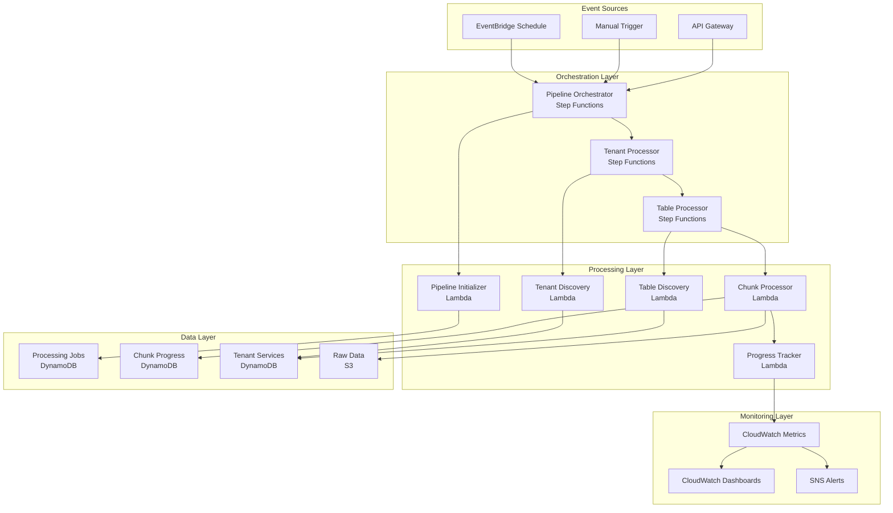

# AVESA Data Pipeline Performance Optimization Architecture

## Executive Summary

This document outlines the comprehensive performance optimization strategy for the AVESA multi-tenant data pipeline. The optimizations address critical scalability issues including sequential processing, Lambda timeouts, lack of progress visibility, and inefficient API pagination patterns.

## Current Architecture Analysis

### Performance Bottlenecks Identified

1. **Sequential Processing Limitations**
   - Current [`lambda_handler()`](../src/integrations/connectwise/lambda_function.py:63) processes tenants sequentially
   - Nested loops for tenant → table processing create multiplicative delays
   - No parallelization at any level of the pipeline

2. **API Pagination Inefficiencies**
   - [`fetch_connectwise_data()`](../src/integrations/connectwise/lambda_function.py:454) uses page-by-page fetching
   - Fixed 1000 record page sizes regardless of data complexity
   - No concurrent API request handling

3. **Lambda Timeout Constraints**
   - 15-minute maximum execution time per Lambda
   - No graceful timeout handling or resumption logic
   - Processing state lost on timeout

4. **Limited Observability**
   - Minimal progress tracking during execution
   - No real-time processing metrics
   - Difficult to diagnose performance issues

5. **Single-Tenant Execution Model**
   - Not optimized for hundreds of concurrent tenants
   - Resource contention and inefficient scaling

## Optimized Architecture Overview

### High-Level Design Principles

1. **Multi-Level Parallelization**: Parallel processing at tenant, table, and chunk levels
2. **Resumable Processing**: State persistence and graceful continuation on timeouts
3. **Intelligent Chunking**: Dynamic chunk sizing based on data characteristics
4. **Real-Time Monitoring**: Comprehensive progress tracking and performance metrics
5. **Fault Tolerance**: Robust error handling and automatic retry mechanisms

### Architecture Diagram



## Core Components

### 1. Step Functions Orchestration

#### Pipeline Orchestrator State Machine
- **Purpose**: Main entry point for all data pipeline executions
- **Responsibilities**:
  - Determine processing mode (single-tenant vs multi-tenant)
  - Initialize job tracking and monitoring
  - Coordinate tenant-level parallel processing
  - Aggregate results and trigger downstream processes

#### Tenant Processor State Machine
- **Purpose**: Process all tables for a single tenant
- **Responsibilities**:
  - Discover enabled tables for tenant
  - Coordinate parallel table processing
  - Handle tenant-level error recovery
  - Trigger canonical transformations

#### Table Processor State Machine
- **Purpose**: Process a single table with chunked data ingestion
- **Responsibilities**:
  - Calculate optimal chunk sizes
  - Execute chunked data fetching
  - Track progress and handle timeouts
  - Manage retry logic for failed chunks

### 2. Enhanced Lambda Functions

#### Pipeline Initializer Lambda
```python
def lambda_handler(event, context):
    """
    Initialize pipeline execution with job tracking and tenant discovery.
    
    Responsibilities:
    - Create processing job record
    - Discover target tenants
    - Calculate processing estimates
    - Initialize monitoring metrics
    """
    job_id = create_processing_job(event)
    tenants = discover_tenants(event.get('tenant_id'))
    
    return {
        'job_id': job_id,
        'mode': 'multi-tenant' if len(tenants) > 1 else 'single-tenant',
        'tenants': tenants,
        'estimated_duration': calculate_processing_estimate(tenants)
    }
```

#### Chunk Processor Lambda
```python
def lambda_handler(event, context):
    """
    Process a single data chunk with optimized API calls and progress tracking.
    
    Features:
    - Intelligent pagination with concurrent requests
    - Real-time progress updates
    - Graceful timeout handling
    - Automatic retry on failures
    """
    timeout_handler = TimeoutHandler(context)
    progress_tracker = ProgressTracker(event['job_id'])
    
    while has_more_chunks(event) and timeout_handler.should_continue():
        chunk = process_next_chunk(event)
        progress_tracker.update_progress(chunk)
        
        if not timeout_handler.should_continue():
            return timeout_handler.checkpoint_and_continue(event)
    
    return complete_processing(event)
```

### 3. Data Storage Optimization

#### New DynamoDB Tables

**ProcessingJobs Table**
```json
{
  "TableName": "ProcessingJobs-{environment}",
  "KeySchema": [
    {"AttributeName": "job_id", "KeyType": "HASH"},
    {"AttributeName": "tenant_id", "KeyType": "RANGE"}
  ],
  "AttributeDefinitions": [
    {"AttributeName": "job_id", "AttributeType": "S"},
    {"AttributeName": "tenant_id", "AttributeType": "S"},
    {"AttributeName": "status", "AttributeType": "S"},
    {"AttributeName": "created_at", "AttributeType": "S"}
  ],
  "GlobalSecondaryIndexes": [
    {
      "IndexName": "StatusIndex",
      "KeySchema": [
        {"AttributeName": "status", "KeyType": "HASH"},
        {"AttributeName": "created_at", "KeyType": "RANGE"}
      ]
    }
  ]
}
```

**ChunkProgress Table**
```json
{
  "TableName": "ChunkProgress-{environment}",
  "KeySchema": [
    {"AttributeName": "job_id", "KeyType": "HASH"},
    {"AttributeName": "chunk_id", "KeyType": "RANGE"}
  ],
  "AttributeDefinitions": [
    {"AttributeName": "job_id", "AttributeType": "S"},
    {"AttributeName": "chunk_id", "AttributeType": "S"},
    {"AttributeName": "tenant_id", "AttributeType": "S"},
    {"AttributeName": "table_name", "AttributeType": "S"}
  ],
  "GlobalSecondaryIndexes": [
    {
      "IndexName": "TenantTableIndex",
      "KeySchema": [
        {"AttributeName": "tenant_id", "KeyType": "HASH"},
        {"AttributeName": "table_name", "KeyType": "RANGE"}
      ]
    }
  ]
}
```

### 4. Intelligent Chunking Strategy

#### Dynamic Chunk Sizing Algorithm
```python
class ChunkingStrategy:
    def __init__(self):
        self.base_chunk_size = 5000  # records
        self.max_chunk_size = 15000
        self.min_chunk_size = 1000
        
        # Table complexity factors
        self.complexity_factors = {
            'service/tickets': 0.7,      # Complex nested data
            'time/entries': 1.3,         # Simpler structure
            'company/companies': 1.0,    # Medium complexity
            'company/contacts': 1.2      # Simple structure
        }
    
    def calculate_optimal_chunk_size(self, table_name: str, 
                                   estimated_records: int,
                                   avg_record_size: int) -> int:
        """Calculate optimal chunk size based on table characteristics."""
        
        # Base calculation
        complexity_factor = self.complexity_factors.get(table_name, 1.0)
        base_size = int(self.base_chunk_size * complexity_factor)
        
        # Adjust for record size (aim for ~50MB per chunk)
        target_size_mb = 50
        target_size_bytes = target_size_mb * 1024 * 1024
        size_based_chunk = target_size_bytes // avg_record_size
        
        # Use the more conservative estimate
        optimal_size = min(base_size, size_based_chunk)
        
        # Apply bounds
        return max(self.min_chunk_size, 
                  min(self.max_chunk_size, optimal_size))
    
    def create_chunks(self, table_name: str, total_records: int) -> List[dict]:
        """Create chunk definitions for processing."""
        chunk_size = self.calculate_optimal_chunk_size(
            table_name, total_records, 1024  # Assume 1KB avg record
        )
        
        chunks = []
        for i in range(0, total_records, chunk_size):
            chunks.append({
                'chunk_id': f"{table_name}_{i}_{min(i + chunk_size, total_records)}",
                'start_offset': i,
                'end_offset': min(i + chunk_size, total_records),
                'estimated_records': min(chunk_size, total_records - i)
            })
        
        return chunks
```

### 5. Concurrent API Processing

#### Optimized Pagination with Concurrency
```python
import asyncio
import aiohttp
from typing import List, Dict, Any

class ConcurrentAPIProcessor:
    def __init__(self, credentials, max_concurrent: int = 5):
        self.credentials = credentials
        self.max_concurrent = max_concurrent
        self.semaphore = asyncio.Semaphore(max_concurrent)
        self.session = None
    
    async def fetch_data_concurrent(self, endpoint: str, 
                                  chunk_config: dict) -> List[Dict[str, Any]]:
        """Fetch data using concurrent API requests."""
        
        async with aiohttp.ClientSession() as session:
            self.session = session
            
            # Estimate total pages needed
            first_page = await self.fetch_page(endpoint, 1, 1000)
            total_records = self.estimate_total_records(first_page)
            
            if total_records <= 1000:
                # Small dataset, use single request
                return await self.fetch_page(endpoint, 1, total_records)
            
            # Large dataset, use concurrent requests
            page_size = 2000  # Larger pages for better throughput
            total_pages = (total_records + page_size - 1) // page_size
            
            # Create tasks for concurrent execution
            tasks = []
            for page_num in range(1, total_pages + 1):
                task = self.fetch_page_with_semaphore(endpoint, page_num, page_size)
                tasks.append(task)
            
            # Execute concurrently
            results = await asyncio.gather(*tasks, return_exceptions=True)
            
            # Combine results and handle errors
            all_records = []
            for result in results:
                if isinstance(result, Exception):
                    logger.error(f"Page fetch failed: {result}")
                    continue
                all_records.extend(result)
            
            return all_records
    
    async def fetch_page_with_semaphore(self, endpoint: str, 
                                      page: int, page_size: int) -> List[Dict]:
        """Fetch single page with concurrency control."""
        async with self.semaphore:
            return await self.fetch_page(endpoint, page, page_size)
    
    async def fetch_page(self, endpoint: str, page: int, 
                        page_size: int) -> List[Dict]:
        """Fetch single page from API."""
        url = self.build_url(endpoint)
        headers = self.build_headers()
        params = {
            'page': page,
            'pageSize': page_size,
            'orderBy': 'id asc'
        }
        
        async with self.session.get(url, headers=headers, params=params) as response:
            if response.status != 200:
                raise Exception(f"API request failed: {response.status}")
            
            return await response.json()
```

### 6. Progress Monitoring and Alerting

#### Real-Time Progress Tracking
```python
class ProgressTracker:
    def __init__(self, job_id: str):
        self.job_id = job_id
        self.dynamodb = boto3.resource('dynamodb')
        self.cloudwatch = boto3.client('cloudwatch')
        self.jobs_table = self.dynamodb.Table('ProcessingJobs')
        self.chunks_table = self.dynamodb.Table('ChunkProgress')
    
    def update_job_progress(self, completed_chunks: int, total_chunks: int):
        """Update overall job progress."""
        progress_percentage = (completed_chunks / total_chunks) * 100
        
        # Update DynamoDB
        self.jobs_table.update_item(
            Key={'job_id': self.job_id},
            UpdateExpression='SET completed_chunks = :cc, progress_percentage = :pp, updated_at = :ua',
            ExpressionAttributeValues={
                ':cc': completed_chunks,
                ':pp': Decimal(str(progress_percentage)),
                ':ua': datetime.utcnow().isoformat()
            }
        )
        
        # Send CloudWatch metrics
        self.cloudwatch.put_metric_data(
            Namespace='AVESA/DataPipeline',
            MetricData=[
                {
                    'MetricName': 'JobProgress',
                    'Dimensions': [{'Name': 'JobId', 'Value': self.job_id}],
                    'Value': progress_percentage,
                    'Unit': 'Percent'
                }
            ]
        )
    
    def update_chunk_progress(self, chunk_id: str, status: str, 
                            record_count: int = 0, processing_time: float = 0):
        """Update individual chunk progress."""
        self.chunks_table.update_item(
            Key={'job_id': self.job_id, 'chunk_id': chunk_id},
            UpdateExpression='SET #status = :s, record_count = :rc, processing_time = :pt, updated_at = :ua',
            ExpressionAttributeNames={'#status': 'status'},
            ExpressionAttributeValues={
                ':s': status,
                ':rc': record_count,
                ':pt': Decimal(str(processing_time)),
                ':ua': datetime.utcnow().isoformat()
            }
        )
        
        # Send chunk-level metrics
        self.cloudwatch.put_metric_data(
            Namespace='AVESA/DataPipeline',
            MetricData=[
                {
                    'MetricName': 'ChunkProcessingTime',
                    'Value': processing_time,
                    'Unit': 'Seconds'
                },
                {
                    'MetricName': 'ChunkRecordCount',
                    'Value': record_count,
                    'Unit': 'Count'
                }
            ]
        )
```

### 7. Error Handling and Resilience

#### Comprehensive Error Recovery
```python
class ErrorHandler:
    def __init__(self, max_retries: int = 3):
        self.max_retries = max_retries
        self.retry_delays = [30, 60, 120]  # Exponential backoff
    
    async def execute_with_retry(self, operation: callable, 
                               context: dict) -> dict:
        """Execute operation with automatic retry logic."""
        last_exception = None
        
        for attempt in range(self.max_retries + 1):
            try:
                result = await operation(context)
                
                # Log successful retry
                if attempt > 0:
                    logger.info(f"Operation succeeded after {attempt} retries")
                
                return result
                
            except Exception as e:
                last_exception = e
                
                if attempt < self.max_retries:
                    delay = self.retry_delays[min(attempt, len(self.retry_delays) - 1)]
                    logger.warning(f"Operation failed (attempt {attempt + 1}), retrying in {delay}s: {e}")
                    await asyncio.sleep(delay)
                else:
                    logger.error(f"Operation failed after {self.max_retries} retries: {e}")
        
        # All retries exhausted
        raise last_exception
    
    def handle_api_errors(self, response_status: int, response_text: str):
        """Handle specific API error conditions."""
        if response_status == 429:
            # Rate limit exceeded
            raise RateLimitExceeded("API rate limit exceeded")
        elif response_status == 401:
            # Authentication failed
            raise AuthenticationError("API authentication failed")
        elif response_status == 403:
            # Permission denied
            raise PermissionError("API permission denied")
        elif response_status >= 500:
            # Server error (retryable)
            raise ServerError(f"API server error: {response_status}")
        else:
            # Client error (non-retryable)
            raise ClientError(f"API client error: {response_status} - {response_text}")
```

## Performance Targets

### Scalability Goals
- **Tenant Concurrency**: Support 100+ concurrent tenants
- **Processing Throughput**: 10,000+ records per minute per tenant
- **API Efficiency**: 5x improvement in API call efficiency
- **Timeout Reduction**: 95% reduction in Lambda timeouts

### Monitoring Metrics
- **Processing Rate**: Records processed per minute
- **API Response Time**: Average API call duration
- **Error Rate**: Percentage of failed operations
- **Resource Utilization**: Lambda memory and CPU usage
- **Cost Efficiency**: Cost per record processed

## Migration Strategy

### Phase 1: Infrastructure Setup (Week 1-2)
1. Deploy new DynamoDB tables
2. Create Step Functions state machines
3. Implement basic parallel processing
4. Set up monitoring infrastructure

### Phase 2: Core Optimization (Week 3-4)
1. Implement chunked processing
2. Add concurrent API calls
3. Deploy progress tracking
4. Implement timeout handling

### Phase 3: Advanced Features (Week 5-6)
1. Add intelligent chunking
2. Implement error recovery
3. Deploy monitoring dashboards
4. Performance tuning

### Phase 4: Validation & Rollout (Week 7-8)
1. Load testing and validation
2. Gradual tenant migration
3. Performance monitoring
4. Documentation and training

## Risk Mitigation

### Technical Risks
- **API Rate Limits**: Implement adaptive rate limiting and circuit breakers
- **Memory Constraints**: Use streaming processing and efficient data structures
- **State Consistency**: Implement atomic operations and transaction patterns
- **Cost Escalation**: Monitor costs and implement budget alerts

### Operational Risks
- **Migration Complexity**: Phased rollout with rollback capabilities
- **Data Integrity**: Comprehensive validation and reconciliation
- **Service Dependencies**: Implement fallback mechanisms
- **Team Knowledge**: Documentation and training programs

## Success Criteria

### Performance Improvements
- [ ] 10x improvement in processing throughput
- [ ] 95% reduction in Lambda timeouts
- [ ] 5x improvement in API efficiency
- [ ] Real-time progress visibility

### Operational Excellence
- [ ] Automated error recovery
- [ ] Comprehensive monitoring
- [ ] Cost optimization
- [ ] Scalable architecture

### Business Impact
- [ ] Support for 500+ tenants
- [ ] Near real-time data processing
- [ ] Improved system reliability
- [ ] Reduced operational overhead