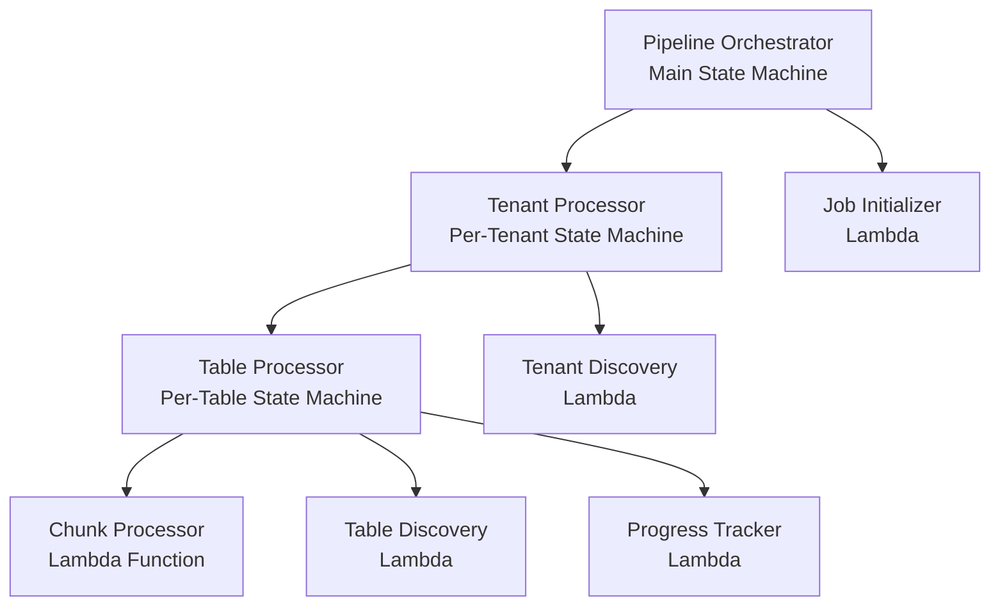

# Step Functions Workflow Design for AVESA Performance Optimization

## Overview

This document details the Step Functions state machine designs that orchestrate the optimized AVESA data pipeline. The workflow implements multi-level parallelization, intelligent error handling, and resumable processing to achieve high-performance data ingestion at scale.

## Architecture Hierarchy



## 1. Pipeline Orchestrator State Machine

### Purpose
Main entry point that coordinates the entire data pipeline execution, handling both single-tenant and multi-tenant processing modes.

### State Machine Definition

```json
{
  "Comment": "AVESA Data Pipeline Orchestrator - Main entry point for all pipeline executions",
  "StartAt": "InitializePipeline",
  "States": {
    "InitializePipeline": {
      "Type": "Task",
      "Resource": "arn:aws:lambda:${AWS::Region}:${AWS::AccountId}:function:avesa-pipeline-initializer-${Environment}",
      "Parameters": {
        "tenant_id.$": "$.tenant_id",
        "table_name.$": "$.table_name",
        "force_full_sync.$": "$.force_full_sync",
        "execution_id.$": "$$.Execution.Name"
      },
      "ResultPath": "$.pipeline_config",
      "Retry": [
        {
          "ErrorEquals": ["States.TaskFailed"],
          "IntervalSeconds": 10,
          "MaxAttempts": 3,
          "BackoffRate": 2.0
        }
      ],
      "Catch": [
        {
          "ErrorEquals": ["States.ALL"],
          "Next": "HandleInitializationFailure",
          "ResultPath": "$.error"
        }
      ],
      "Next": "DetermineProcessingMode"
    },
    
    "DetermineProcessingMode": {
      "Type": "Choice",
      "Choices": [
        {
          "Variable": "$.pipeline_config.mode",
          "StringEquals": "multi-tenant",
          "Next": "MultiTenantProcessing"
        },
        {
          "Variable": "$.pipeline_config.mode",
          "StringEquals": "single-tenant",
          "Next": "SingleTenantProcessing"
        }
      ],
      "Default": "HandleInvalidMode"
    },
    
    "MultiTenantProcessing": {
      "Type": "Map",
      "ItemsPath": "$.pipeline_config.tenants",
      "MaxConcurrency": 10,
      "Parameters": {
        "tenant_config.$": "$$.Map.Item.Value",
        "job_id.$": "$.pipeline_config.job_id",
        "execution_id.$": "$$.Execution.Name"
      },
      "Iterator": {
        "StartAt": "ProcessTenant",
        "States": {
          "ProcessTenant": {
            "Type": "Task",
            "Resource": "arn:aws:states:::states:startExecution.sync:2",
            "Parameters": {
              "StateMachineArn": "arn:aws:states:${AWS::Region}:${AWS::AccountId}:stateMachine:TenantProcessor-${Environment}",
              "Input": {
                "tenant_config.$": "$.tenant_config",
                "job_id.$": "$.job_id",
                "execution_id.$": "$.execution_id"
              }
            },
            "Retry": [
              {
                "ErrorEquals": ["States.ExecutionLimitExceeded"],
                "IntervalSeconds": 60,
                "MaxAttempts": 5,
                "BackoffRate": 2.0
              }
            ],
            "Catch": [
              {
                "ErrorEquals": ["States.ALL"],
                "Next": "TenantProcessingFailed",
                "ResultPath": "$.error"
              }
            ],
            "End": true
          },
          "TenantProcessingFailed": {
            "Type": "Pass",
            "Parameters": {
              "tenant_id.$": "$.tenant_config.tenant_id",
              "status": "failed",
              "error.$": "$.error"
            },
            "End": true
          }
        }
      },
      "ResultPath": "$.tenant_results",
      "Next": "AggregateMultiTenantResults"
    },
    
    "SingleTenantProcessing": {
      "Type": "Task",
      "Resource": "arn:aws:states:::states:startExecution.sync:2",
      "Parameters": {
        "StateMachineArn": "arn:aws:states:${AWS::Region}:${AWS::AccountId}:stateMachine:TenantProcessor-${Environment}",
        "Input": {
          "tenant_config.$": "$.pipeline_config.tenants[0]",
          "job_id.$": "$.pipeline_config.job_id",
          "execution_id.$": "$$.Execution.Name"
        }
      },
      "ResultPath": "$.tenant_result",
      "Next": "AggregateSingleTenantResults"
    },
    
    "AggregateMultiTenantResults": {
      "Type": "Task",
      "Resource": "arn:aws:lambda:${AWS::Region}:${AWS::AccountId}:function:avesa-result-aggregator-${Environment}",
      "Parameters": {
        "job_id.$": "$.pipeline_config.job_id",
        "tenant_results.$": "$.tenant_results",
        "processing_mode": "multi-tenant"
      },
      "Next": "NotifyCompletion"
    },
    
    "AggregateSingleTenantResults": {
      "Type": "Task",
      "Resource": "arn:aws:lambda:${AWS::Region}:${AWS::AccountId}:function:avesa-result-aggregator-${Environment}",
      "Parameters": {
        "job_id.$": "$.pipeline_config.job_id",
        "tenant_result.$": "$.tenant_result",
        "processing_mode": "single-tenant"
      },
      "Next": "NotifyCompletion"
    },
    
    "NotifyCompletion": {
      "Type": "Task",
      "Resource": "arn:aws:lambda:${AWS::Region}:${AWS::AccountId}:function:avesa-completion-notifier-${Environment}",
      "Parameters": {
        "job_id.$": "$.pipeline_config.job_id",
        "results.$": "$",
        "execution_arn.$": "$$.Execution.Name"
      },
      "End": true
    },
    
    "HandleInitializationFailure": {
      "Type": "Task",
      "Resource": "arn:aws:lambda:${AWS::Region}:${AWS::AccountId}:function:avesa-error-handler-${Environment}",
      "Parameters": {
        "error_type": "initialization_failure",
        "error_details.$": "$.error",
        "input.$": "$"
      },
      "Next": "PipelineFailure"
    },
    
    "HandleInvalidMode": {
      "Type": "Fail",
      "Cause": "Invalid processing mode specified",
      "Error": "InvalidProcessingMode"
    },
    
    "PipelineFailure": {
      "Type": "Fail",
      "Cause": "Pipeline execution failed",
      "Error": "PipelineExecutionFailure"
    }
  }
}
```

### Input Schema
```json
{
  "tenant_id": "string (optional - if not provided, processes all tenants)",
  "table_name": "string (optional - if not provided, processes all tables)",
  "force_full_sync": "boolean (optional - forces full sync instead of incremental)",
  "chunk_size_override": "number (optional - overrides default chunk size)",
  "priority": "string (optional - high|normal|low)"
}
```

### Output Schema
```json
{
  "job_id": "string",
  "status": "completed|failed|partial",
  "total_tenants": "number",
  "successful_tenants": "number",
  "failed_tenants": "number",
  "total_records_processed": "number",
  "execution_time_seconds": "number",
  "tenant_results": [
    {
      "tenant_id": "string",
      "status": "completed|failed",
      "records_processed": "number",
      "tables_processed": "number",
      "execution_time": "number"
    }
  ]
}
```

## 2. Tenant Processor State Machine

### Purpose
Processes all enabled tables for a single tenant with parallel table processing and comprehensive error handling.

### State Machine Definition

```json
{
  "Comment": "AVESA Tenant Processor - Handles all table processing for a single tenant",
  "StartAt": "DiscoverTenantTables",
  "States": {
    "DiscoverTenantTables": {
      "Type": "Task",
      "Resource": "arn:aws:lambda:${AWS::Region}:${AWS::AccountId}:function:avesa-table-discovery-${Environment}",
      "Parameters": {
        "tenant_config.$": "$.tenant_config",
        "job_id.$": "$.job_id"
      },
      "ResultPath": "$.table_discovery",
      "Retry": [
        {
          "ErrorEquals": ["States.TaskFailed"],
          "IntervalSeconds": 5,
          "MaxAttempts": 3,
          "BackoffRate": 2.0
        }
      ],
      "Next": "ValidateTableDiscovery"
    },
    
    "ValidateTableDiscovery": {
      "Type": "Choice",
      "Choices": [
        {
          "Variable": "$.table_discovery.enabled_tables",
          "IsPresent": true,
          "Next": "CheckTableCount"
        }
      ],
      "Default": "NoTablesFound"
    },
    
    "CheckTableCount": {
      "Type": "Choice",
      "Choices": [
        {
          "Variable": "$.table_discovery.table_count",
          "NumericGreaterThan": 0,
          "Next": "ParallelTableProcessing"
        }
      ],
      "Default": "NoTablesEnabled"
    },
    
    "ParallelTableProcessing": {
      "Type": "Map",
      "ItemsPath": "$.table_discovery.enabled_tables",
      "MaxConcurrency": 4,
      "Parameters": {
        "table_config.$": "$$.Map.Item.Value",
        "tenant_config.$": "$.tenant_config",
        "job_id.$": "$.job_id",
        "execution_id.$": "$.execution_id"
      },
      "Iterator": {
        "StartAt": "ProcessTable",
        "States": {
          "ProcessTable": {
            "Type": "Task",
            "Resource": "arn:aws:states:::states:startExecution.sync:2",
            "Parameters": {
              "StateMachineArn": "arn:aws:states:${AWS::Region}:${AWS::AccountId}:stateMachine:TableProcessor-${Environment}",
              "Input": {
                "table_config.$": "$.table_config",
                "tenant_config.$": "$.tenant_config",
                "job_id.$": "$.job_id",
                "execution_id.$": "$.execution_id"
              }
            },
            "Retry": [
              {
                "ErrorEquals": ["States.ExecutionLimitExceeded"],
                "IntervalSeconds": 30,
                "MaxAttempts": 3,
                "BackoffRate": 2.0
              },
              {
                "ErrorEquals": ["States.TaskFailed"],
                "IntervalSeconds": 15,
                "MaxAttempts": 2,
                "BackoffRate": 2.0
              }
            ],
            "Catch": [
              {
                "ErrorEquals": ["States.ALL"],
                "Next": "TableProcessingFailed",
                "ResultPath": "$.error"
              }
            ],
            "End": true
          },
          "TableProcessingFailed": {
            "Type": "Pass",
            "Parameters": {
              "table_name.$": "$.table_config.table_name",
              "tenant_id.$": "$.tenant_config.tenant_id",
              "status": "failed",
              "error.$": "$.error"
            },
            "End": true
          }
        }
      },
      "ResultPath": "$.table_results",
      "Next": "EvaluateTableResults"
    },
    
    "EvaluateTableResults": {
      "Type": "Task",
      "Resource": "arn:aws:lambda:${AWS::Region}:${AWS::AccountId}:function:avesa-table-result-evaluator-${Environment}",
      "Parameters": {
        "tenant_id.$": "$.tenant_config.tenant_id",
        "job_id.$": "$.job_id",
        "table_results.$": "$.table_results"
      },
      "ResultPath": "$.evaluation",
      "Next": "CheckCanonicalTransformTrigger"
    },
    
    "CheckCanonicalTransformTrigger": {
      "Type": "Choice",
      "Choices": [
        {
          "Variable": "$.evaluation.should_trigger_canonical",
          "BooleanEquals": true,
          "Next": "TriggerCanonicalTransformation"
        }
      ],
      "Default": "TenantProcessingComplete"
    },
    
    "TriggerCanonicalTransformation": {
      "Type": "Task",
      "Resource": "arn:aws:lambda:${AWS::Region}:${AWS::AccountId}:function:avesa-canonical-trigger-${Environment}",
      "Parameters": {
        "tenant_id.$": "$.tenant_config.tenant_id",
        "job_id.$": "$.job_id",
        "completed_tables.$": "$.evaluation.completed_tables"
      },
      "Retry": [
        {
          "ErrorEquals": ["States.TaskFailed"],
          "IntervalSeconds": 10,
          "MaxAttempts": 2,
          "BackoffRate": 2.0
        }
      ],
      "Next": "TenantProcessingComplete"
    },
    
    "TenantProcessingComplete": {
      "Type": "Pass",
      "Parameters": {
        "tenant_id.$": "$.tenant_config.tenant_id",
        "status": "completed",
        "table_results.$": "$.table_results",
        "evaluation.$": "$.evaluation"
      },
      "End": true
    },
    
    "NoTablesFound": {
      "Type": "Pass",
      "Parameters": {
        "tenant_id.$": "$.tenant_config.tenant_id",
        "status": "completed",
        "message": "No tables found for tenant",
        "table_count": 0
      },
      "End": true
    },
    
    "NoTablesEnabled": {
      "Type": "Pass",
      "Parameters": {
        "tenant_id.$": "$.tenant_config.tenant_id",
        "status": "completed",
        "message": "No tables enabled for processing",
        "table_count": 0
      },
      "End": true
    }
  }
}
```

## 3. Table Processor State Machine

### Purpose
Processes a single table with intelligent chunking, progress tracking, and resumable execution.

### State Machine Definition

```json
{
  "Comment": "AVESA Table Processor - Handles chunked processing of a single table",
  "StartAt": "InitializeTableProcessing",
  "States": {
    "InitializeTableProcessing": {
      "Type": "Task",
      "Resource": "arn:aws:lambda:${AWS::Region}:${AWS::AccountId}:function:avesa-table-initializer-${Environment}",
      "Parameters": {
        "table_config.$": "$.table_config",
        "tenant_config.$": "$.tenant_config",
        "job_id.$": "$.job_id"
      },
      "ResultPath": "$.table_state",
      "Retry": [
        {
          "ErrorEquals": ["States.TaskFailed"],
          "IntervalSeconds": 5,
          "MaxAttempts": 3,
          "BackoffRate": 2.0
        }
      ],
      "Next": "CalculateChunks"
    },
    
    "CalculateChunks": {
      "Type": "Task",
      "Resource": "arn:aws:lambda:${AWS::Region}:${AWS::AccountId}:function:avesa-chunk-calculator-${Environment}",
      "Parameters": {
        "table_config.$": "$.table_config",
        "tenant_config.$": "$.tenant_config",
        "table_state.$": "$.table_state"
      },
      "ResultPath": "$.chunk_plan",
      "Next": "ValidateChunkPlan"
    },
    
    "ValidateChunkPlan": {
      "Type": "Choice",
      "Choices": [
        {
          "Variable": "$.chunk_plan.total_chunks",
          "NumericGreaterThan": 0,
          "Next": "ProcessChunks"
        }
      ],
      "Default": "NoDataToProcess"
    },
    
    "ProcessChunks": {
      "Type": "Map",
      "ItemsPath": "$.chunk_plan.chunks",
      "MaxConcurrency": 3,
      "Parameters": {
        "chunk_config.$": "$$.Map.Item.Value",
        "table_config.$": "$.table_config",
        "tenant_config.$": "$.tenant_config",
        "job_id.$": "$.job_id",
        "table_state.$": "$.table_state"
      },
      "Iterator": {
        "StartAt": "ProcessChunk",
        "States": {
          "ProcessChunk": {
            "Type": "Task",
            "Resource": "arn:aws:lambda:${AWS::Region}:${AWS::AccountId}:function:avesa-chunk-processor-${Environment}",
            "Parameters": {
              "chunk_config.$": "$.chunk_config",
              "table_config.$": "$.table_config",
              "tenant_config.$": "$.tenant_config",
              "job_id.$": "$.job_id"
            },
            "TimeoutSeconds": 900,
            "Retry": [
              {
                "ErrorEquals": ["States.TaskFailed"],
                "IntervalSeconds": 30,
                "MaxAttempts": 3,
                "BackoffRate": 2.0
              },
              {
                "ErrorEquals": ["Lambda.TooManyRequestsException"],
                "IntervalSeconds": 60,
                "MaxAttempts": 5,
                "BackoffRate": 2.0
              }
            ],
            "Catch": [
              {
                "ErrorEquals": ["States.Timeout"],
                "Next": "HandleChunkTimeout",
                "ResultPath": "$.timeout_error"
              },
              {
                "ErrorEquals": ["States.ALL"],
                "Next": "ChunkProcessingFailed",
                "ResultPath": "$.error"
              }
            ],
            "Next": "UpdateChunkProgress"
          },
          
          "UpdateChunkProgress": {
            "Type": "Task",
            "Resource": "arn:aws:lambda:${AWS::Region}:${AWS::AccountId}:function:avesa-progress-tracker-${Environment}",
            "Parameters": {
              "job_id.$": "$.job_id",
              "chunk_id.$": "$.chunk_config.chunk_id",
              "status": "completed",
              "result.$": "$"
            },
            "End": true
          },
          
          "HandleChunkTimeout": {
            "Type": "Task",
            "Resource": "arn:aws:lambda:${AWS::Region}:${AWS::AccountId}:function:avesa-timeout-handler-${Environment}",
            "Parameters": {
              "job_id.$": "$.job_id",
              "chunk_config.$": "$.chunk_config",
              "timeout_error.$": "$.timeout_error"
            },
            "Next": "ScheduleChunkResumption"
          },
          
          "ScheduleChunkResumption": {
            "Type": "Task",
            "Resource": "arn:aws:states:::states:startExecution",
            "Parameters": {
              "StateMachineArn": "arn:aws:states:${AWS::Region}:${AWS::AccountId}:stateMachine:TableProcessor-${Environment}",
              "Input": {
                "table_config.$": "$.table_config",
                "tenant_config.$": "$.tenant_config",
                "job_id.$": "$.job_id",
                "resume_chunk_id.$": "$.chunk_config.chunk_id"
              }
            },
            "End": true
          },
          
          "ChunkProcessingFailed": {
            "Type": "Task",
            "Resource": "arn:aws:lambda:${AWS::Region}:${AWS::AccountId}:function:avesa-progress-tracker-${Environment}",
            "Parameters": {
              "job_id.$": "$.job_id",
              "chunk_id.$": "$.chunk_config.chunk_id",
              "status": "failed",
              "error.$": "$.error"
            },
            "End": true
          }
        }
      },
      "ResultPath": "$.chunk_results",
      "Next": "EvaluateChunkResults"
    },
    
    "EvaluateChunkResults": {
      "Type": "Task",
      "Resource": "arn:aws:lambda:${AWS::Region}:${AWS::AccountId}:function:avesa-chunk-result-evaluator-${Environment}",
      "Parameters": {
        "job_id.$": "$.job_id",
        "table_name.$": "$.table_config.table_name",
        "tenant_id.$": "$.tenant_config.tenant_id",
        "chunk_results.$": "$.chunk_results"
      },
      "ResultPath": "$.table_evaluation",
      "Next": "UpdateLastUpdatedTimestamp"
    },
    
    "UpdateLastUpdatedTimestamp": {
      "Type": "Task",
      "Resource": "arn:aws:lambda:${AWS::Region}:${AWS::AccountId}:function:avesa-timestamp-updater-${Environment}",
      "Parameters": {
        "tenant_id.$": "$.tenant_config.tenant_id",
        "table_name.$": "$.table_config.table_name",
        "job_id.$": "$.job_id",
        "chunk_results.$": "$.chunk_results"
      },
      "Next": "TableProcessingComplete"
    },
    
    "TableProcessingComplete": {
      "Type": "Pass",
      "Parameters": {
        "table_name.$": "$.table_config.table_name",
        "tenant_id.$": "$.tenant_config.tenant_id",
        "status": "completed",
        "chunk_results.$": "$.chunk_results",
        "evaluation.$": "$.table_evaluation"
      },
      "End": true
    },
    
    "NoDataToProcess": {
      "Type": "Pass",
      "Parameters": {
        "table_name.$": "$.table_config.table_name",
        "tenant_id.$": "$.tenant_config.tenant_id",
        "status": "completed",
        "message": "No new data to process",
        "records_processed": 0
      },
      "End": true
    }
  }
}
```

## 4. Error Handling Patterns

### Retry Strategies
```json
{
  "retry_patterns": {
    "api_failures": {
      "ErrorEquals": ["States.TaskFailed"],
      "IntervalSeconds": 30,
      "MaxAttempts": 3,
      "BackoffRate": 2.0
    },
    "rate_limiting": {
      "ErrorEquals": ["Lambda.TooManyRequestsException"],
      "IntervalSeconds": 60,
      "MaxAttempts": 5,
      "BackoffRate": 2.0
    },
    "execution_limits": {
      "ErrorEquals": ["States.ExecutionLimitExceeded"],
      "IntervalSeconds": 120,
      "MaxAttempts": 3,
      "BackoffRate": 1.5
    }
  }
}
```

### Circuit Breaker Implementation
```python
class StepFunctionsCircuitBreaker:
    def __init__(self, failure_threshold: int = 5, recovery_timeout: int = 300):
        self.failure_threshold = failure_threshold
        self.recovery_timeout = recovery_timeout
        self.failure_count = 0
        self.last_failure_time = None
        self.state = "CLOSED"  # CLOSED, OPEN, HALF_OPEN
    
    def should_execute(self) -> bool:
        if self.state == "CLOSED":
            return True
        elif self.state == "OPEN":
            if time.time() - self.last_failure_time > self.recovery_timeout:
                self.state = "HALF_OPEN"
                return True
            return False
        elif self.state == "HALF_OPEN":
            return True
    
    def record_success(self):
        self.failure_count = 0
        self.state = "CLOSED"
    
    def record_failure(self):
        self.failure_count += 1
        self.last_failure_time = time.time()
        
        if self.failure_count >= self.failure_threshold:
            self.state = "OPEN"
```

## 5. Monitoring and Observability

### CloudWatch Metrics Integration
```json
{
  "custom_metrics": {
    "execution_metrics": [
      "ExecutionDuration",
      "ExecutionSuccess",
      "ExecutionFailure",
      "StateTransitions"
    ],
    "performance_metrics": [
      "ChunksProcessed",
      "RecordsProcessed",
      "APICallsPerSecond",
      "ErrorRate"
    ],
    "business_metrics": [
      "TenantsProcessed",
      "TablesProcessed",
      "DataFreshness",
      "ProcessingCost"
    ]
  }
}
```

### Alerting Rules
```yaml
alerts:
  execution_failure:
    metric: ExecutionFailure
    threshold: 1
    period: 300
    evaluation_periods: 1
    
  high_error_rate:
    metric: ErrorRate
    threshold: 10
    period: 900
    evaluation_periods: 2
    
  processing_delay:
    metric: ExecutionDuration
    threshold: 3600
    period: 300
    evaluation_periods: 1
```

## 6. Cost Optimization

### Execution Cost Analysis
```python
class CostOptimizer:
    def __init__(self):
        self.state_transition_cost = 0.000025  # $0.000025 per transition
        self.lambda_cost_per_gb_second = 0.0000166667
    
    def calculate_execution_cost(self, execution_stats: dict) -> float:
        """Calculate total cost for Step Functions execution."""
        
        # State transition costs
        transition_cost = execution_stats['state_transitions'] * self.state_transition_cost
        
        # Lambda execution costs (calculated separately)
        lambda_cost = execution_stats['lambda_gb_seconds'] * self.lambda_cost_per_gb_second
        
        return transition_cost + lambda_cost
    
    def optimize_concurrency(self, tenant_count: int, avg_processing_time: float) -> int:
        """Calculate optimal concurrency to minimize costs."""
        
        # Balance between execution time and state transition costs
        if tenant_count <= 5:
            return tenant_count  # Process all concurrently
        elif avg_processing_time > 300:  # 5 minutes
            return min(10, tenant_count)  # Higher concurrency for long tasks
        else:
            return min(5, tenant_count)   # Lower concurrency for short tasks
```

## 7. Deployment Configuration

### CDK Stack for Step Functions
```python
class StepFunctionsStack(Stack):
    def __init__(self, scope: Construct, construct_id: str, **kwargs):
        super().__init__(scope, construct_id, **kwargs)
        
        # Create state machines
        self.pipeline_orchestrator = self.create_pipeline_orchestrator()
        self.tenant_processor = self.create_tenant_processor()
        self.table_processor = self.create_table_processor()
        
        # Create IAM roles with least privilege
        self.create_execution_roles()
        
        # Set up CloudWatch logging
        self.create_log_groups()
    
    def create_pipeline_orchestrator(self) -> sfn.StateMachine:
        definition = sfn.DefinitionBody.from_file("state_machines/pipeline_orchestrator.json")
        
        return sfn.StateMachine(
            self, "PipelineOrchestrator",
            state_machine_name=f"PipelineOrchestrator-{self.env_name}",
            definition_body=definition,
            timeout=Duration.hours(6),
            logs=sfn.LogOptions(
                destination=self.orchestrator_log_group,
                level=sfn.LogLevel.ALL
            )
        )
```

## 8. Testing Strategy

### Integration Testing
```python
class StepFunctionsIntegrationTest:
    def test_single_tenant_execution(self):
        """Test single tenant processing flow."""
        input_data = {
            "tenant_id": "test-tenant-001",
            "table_name": "service/tickets"
        }
        
        execution = self.start_execution("PipelineOrchestrator", input_data)
        result = self.wait_for_completion(execution, timeout=1800)
        
        assert result['status'] == 'completed'
        assert result['total_tenants'] == 1
        assert result['successful_tenants'] == 1
    
    def test_multi_tenant_execution(self):
        """Test multi-tenant processing with parallelization."""
        input_data = {
            "tenant_id": None  # Process all tenants
        }
        
        execution = self.start_execution("PipelineOrchestrator", input_data)
        result = self.wait_for_completion(execution, timeout=3600)
        
        assert result['status'] in ['completed', 'partial']
        assert result['total_tenants'] > 1
        assert result['successful_tenants'] >= result['total_tenants'] * 0.9  # 90% success rate
```

This Step Functions workflow design provides a robust, scalable, and cost-effective orchestration layer for the AVESA data pipeline optimization.